# User Guide: Using the App

This covers day-to-day use of the admin dashboard — logging in, managing
partners, tracking support, and everything else you'd do once the app is
already set up and running. If you're looking for installation,
deployment, or infrastructure, see [ADMIN_GUIDE.md](ADMIN_GUIDE.md)
instead.

Screens and actions that require the `admin` role are marked **(Admin
only)** below — see [Understanding your role](#understanding-your-role).

**Contents**

- [Getting started](#getting-started)
- [Managing partners & support](#managing-partners--support)
- [Settings](#settings)
- [Communications](#communications)
- [Integrations](#integrations)
- [Your account & the public site](#your-account--the-public-site)

## Getting started

### Logging in

Go to `/login` and sign in with your email and password. There's no
single sign-on — see
[ADMIN_GUIDE.md § Authentication setup](ADMIN_GUIDE.md#authentication-setup)
for why.

If your account has two-factor authentication enabled, you'll be prompted
for a 6-digit code from your authenticator app after your password. If an
admin has *required* MFA on your account but you haven't set it up yet,
you'll be walked through enrollment (scan a QR code, confirm a code)
before you can do anything else.

### Understanding your role

Every user has one of three full roles:

| Role | Can change |
|---|---|
| `viewer` | Nothing. Read-only. |
| `editor` | Create, edit, and archive/unarchive partners; add support entries, one-time needs, trips, and prayer requests; upload newsletters and documents. Can't delete anything, manage users, or change Church Settings. |
| `admin` | Everything above, plus delete records, manage users, and edit Church Settings. |

**Roles control what you can change, not what you can see.** Every account,
including a `viewer`, can read every partner's full record — home address
and GPS coordinates, family members' phone numbers and birthdays, emergency
contacts, and the real name and photo of partners marked
restricted-access. There is no reduced view for lower roles.

That's a deliberate design choice, not an oversight: this is a small
internal tool for one church, and splitting what staff can see would make
the prayer list less useful without meaningfully protecting anything, since
anyone who needs an account needs the information. But it does mean **an
account is the whole permission** — treat handing one out the same way you'd
treat handing someone the filing cabinet key. If you only want someone to
see what's public, send them the public site; they don't need an account at
all.

**A 4th, narrower account type: Trip Leader.** This one's the exception
to "an account is the whole permission" above, on purpose — a Trip Leader
account is a temporary guest login scoped to a single trip, created from
Manage Users with a role of "Trip Leader" and a trip picked from a
dropdown (an optional expiration date can be set too). It can see and
edit that one trip's own team/meetings/requirements/budget/flights, and
can view (but not edit) that trip's one linked partner page — nothing
else in the app. Use it for an actual trip leader or chaperone who needs
to manage their own trip's logistics without a full account on
everything else. See [SPEC.md § 5.1](SPEC.md#51-trip-leader--a-scoped-guest-not-a-4th-full-role)
for the full access list.

If something you expect to see isn't there (a nav link, a button), it's
almost always a role thing, not a bug — check with whoever manages users
at your church.

### Dashboard overview

The sidebar (and the Home page's card grid, which mirrors it) lists:
**Home**, [**Partners**](#the-partners-list) (or your church's custom
term, e.g. "Go Team Partners," if enabled in Branding),
[**Unmatched Emails**](#receiving) (inbound email only — see
[Email](#email-admin-only) below),
[**Pending Dispatches**](#pending-dispatches) (GroupMe and/or
email sending only),
[**Monthly Support**](#financial-support--one-time-needs),
[**One-Time Needs**](#financial-support--one-time-needs),
[**Prayer Requests**](#prayer-requests),
[**Trips**](#trips) (Existing Trips / Plan a Trip tabs),
[**Newsletters & Docs**](#newsletters--docs),
[**Print Booklet**](#printable-partner-booklet), [**Reports**](#reports)
— visible to everyone, each one only if its
[feature toggle](ADMIN_GUIDE.md#feature-toggles) is on.

**Settings**, an expandable group at the bottom of the
sidebar, appears only for admins and holds **About & Branding**
(Church Info/address and branding together on one page — see [Church
Settings](#church-settings-admin-only)),
[**Manage Users**](#user-management-admin-only),
[**Enabled Features**](ADMIN_GUIDE.md#feature-toggles), and **About
App** ([system info](#system-info-admin-only) and
[database backups](#database-backups-admin-only) together on one
page) up front, then two further sub-groups
that only appear once their own features are on:

- **Communications** — [**Email**](#email-admin-only),
  [**GroupMe**](#groupme-dispatch-admin-only),
  [**WhatsApp**](#whatsapp-dispatch-admin-only), and
  [**Dispatch Settings**](#dispatch-settings-admin-only) (schedules,
  GroupMe's content-type mutes, the restricted-partner safety gate,
  digest appearance, and subscriber counts — the queue itself is
  [**Pending Dispatches**](#pending-dispatches) in the main menu).
- **Integrations** — [**AI Features**](#ai-features-admin-only) and
  [**Joshua Project**](#joshua-project-admin-only).

The footer has **My Account**, a link back to the public
site, and **Log out**.

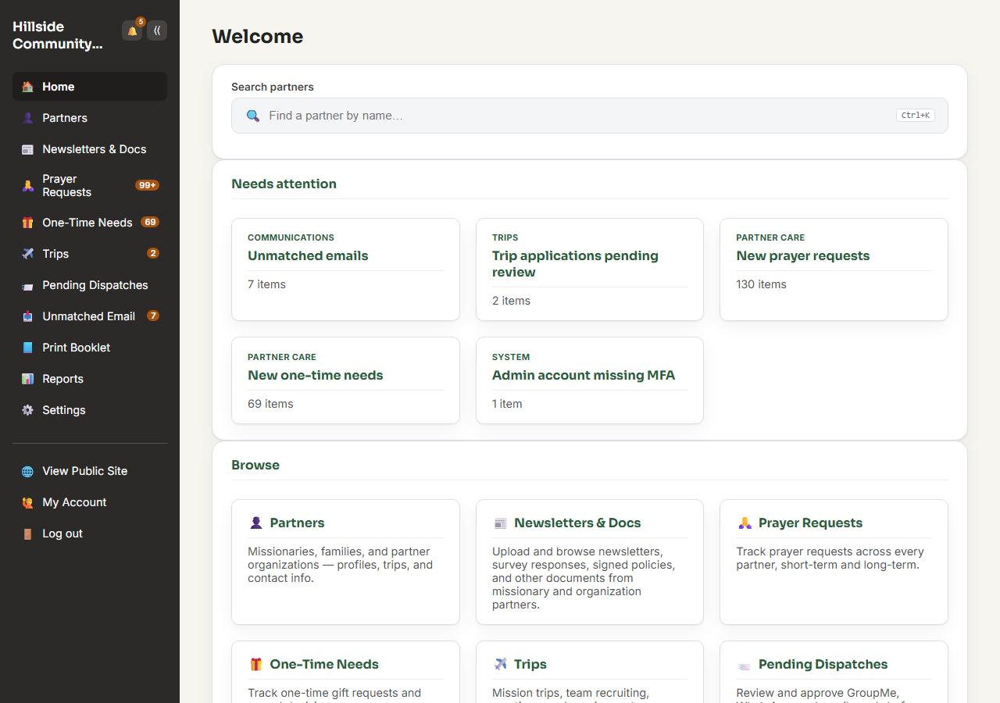

Missionaries and organizations share one combined **Partners** list —
there's no separate nav entry for each; you pick which kind to add from
the list page itself.

## Managing partners & support

### Managing partners (missionaries & organizations)

#### The Partners list

Filter by Type (missionary/organization), Public (yes/no), Restricted
(yes/no), Continent, and Country — the continent/country dropdowns only
show what's actually represented in your data, and picking a continent
narrows the country list to match. There's also a free-text search box
that matches across name, field/region, focus area, short overview, and
country — it's diacritic-insensitive (a search for "sao tome" matches
"São Tomé") and multi-word (typing two words requires both to match
somewhere, not as one exact phrase). A "Show archived" checkbox reveals
archived records, and **Reset filters** clears everything back to
defaults.

Click **+ Add Missionary** or **+ Add Organization** to create one; click
any row to view that partner's detail page.

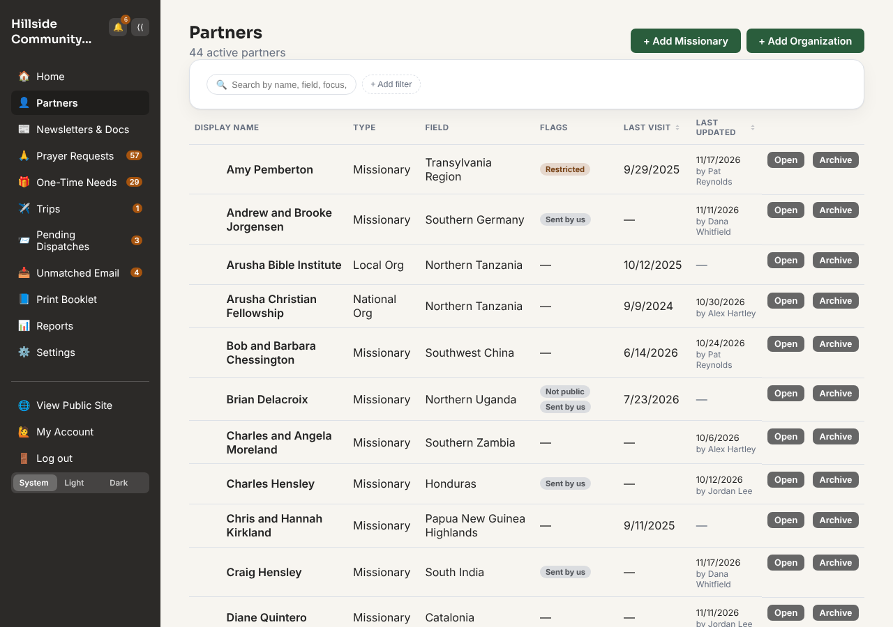

#### Creating a missionary

**+ Add Missionary** opens a short form asking just for what can't be
filled in later from the record itself, plus a couple of fields that are
usually already known the moment you're adding someone and don't need
their own detail-page trip: Display Name (required), Country,
Field/Region Display Name, a Short Overview, **Preferred Contact
Method**, **Supporting Since**, and four checkboxes — **Safe to
contact**, **Show on public site** (`isPublic`), **Restricted-access
location** (`isRestricted` — see
[Understanding restricted-access partners](#understanding-restricted-access-partners)
below before checking this), and **Sent by {your church}**. **Create
Partner** saves it and takes you straight to its detail page, where
everything else — photo, financial support, ministry overview, serving
location, family, trip history, and the rest — gets filled in section by
section. See [Editing a partner](#editing-a-partner) below. Hover any
field's label for a tip on what it means and how it's used.

#### Creating an organization

**+ Add Organization** is the same short form, with **Organization
Name** and an **Organization Type** dropdown (Local/National) in place
of Display Name, and no "Safe to contact" or "Sent by" checkboxes —
those are person-specific.

#### Editing a partner

There's no single "edit form" holding the whole record — each section on
a partner's **detail page** edits on its own. Click that section (or a
specific row's own **Edit**, for a list like Adults or Links), and a
small popup opens with just that section's fields — **Save** (or
**Close**) returns you to the same spot on the page, nothing else
reloads. Every section saves only its own fields, so fixing a typo in
the overview never touches anything else on the record.

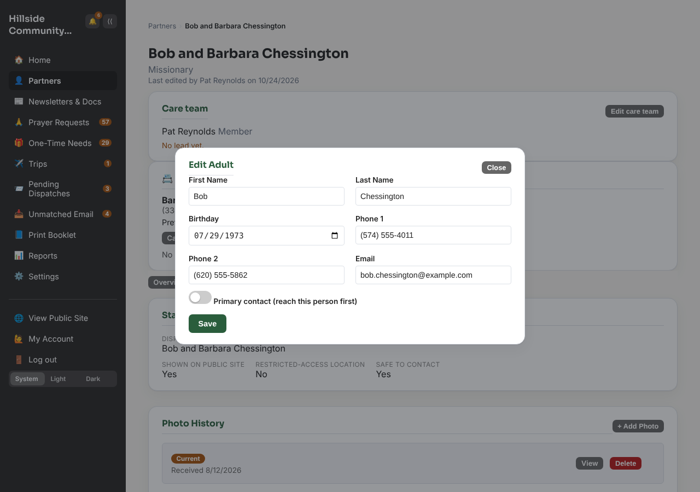

The page groups its sections to match what you'd actually open it to do,
not just what topic they fall under:

- **Photo** (missionary) / **Logo** (organization) — upload (JPEG/PNG/
  WebP) with a live preview and a Received Date. Uploading here always
  adds a new photo rather than replacing the current one — the previous
  photo becomes history instead of being deleted. Only the current photo
  (whichever has the latest Received Date) shows on the public site;
  view the full history or delete an old photo from
  [Photo history](#photo-history) below.
- **Status & Visibility** — the three quick toggles, kept together in
  their own box right under the header pills rather than buried inside a
  content section: **Show on public site** (`isPublic`), **Restricted-
  access location** (`isRestricted`, masks the name to initials and
  coarsens the map pin to a country centroid publicly), and, missionary
  only, **Safe to contact** (`contactSafe`).
- **Ministry Overview** (missionary) / **Focus Area** (organization) —
  Short Overview (used on directory cards), Full Overview, and Ministry
  Focus.
- **Family & Personal** (missionary only):
  - **Family** — Wedding Anniversary, then one row per adult in the
    household (Name, Birthday, two phone numbers, Email) and one per
    child (Name, Birthday).
  - **Languages Spoken** — a free-text tag list.
  - **Emergency Contact** — Name, Phone, Email.
- **Location & Contact**:
  - **Serving Location** — Field/Region Display Name (shown publicly
    even for a restricted partner, so keep it broad — "East Africa," not
    a city, or it undoes the restriction above), a full address (country
    is a suggest-as-you-type field, not a hard dropdown — pick a
    suggestion or type your own if it's not listed), and GPS coordinates.
    Leave both GPS fields blank and saving auto-fills them from the
    city/state/country (via OpenStreetMap) — that lands on the city, not
    an exact address, so enter coordinates yourself for more precise
    placement. This exact address is never shown publicly — only the GPS
    pin is, and only at all if **Show on public site** is checked.
    If [Joshua Project stats](ADMIN_GUIDE.md#feature-toggles) is turned
    on, a **Country Code** field also appears here, used only to look up
    that country's Joshua Project stats right on this page — nothing
    else reads it. It auto-fills from the address's country the first
    time it resolves to a recognized name, but only while the field is
    still blank — enter it yourself and it's never overwritten. It's a
    FIPS code specifically, which for many countries differs from the
    more familiar ISO code (e.g. the Philippines is `RP`, not `PH`) —
    that mismatch is exactly why the auto-fill, and the manual override,
    both exist. **Turning Joshua Project on after partners already
    exist?** The field only appears once the feature is on, so existing
    partners won't have a code yet — open each one's Serving Location
    and either type the code in directly, or clear the Country field and
    re-enter it to trigger the auto-lookup.
  - **Mailing & Contact Address** — Display Name (missionary) or
    Organization Name/Type (organization) — this is the public display
    name shown on the directory, map, and booklet — Preferred Contact
    Method, missionary-only **Safe to contact**, organization-only
    Contact Name/Phone/Email, and a separate mailing address with
    "Receives mail here" / "Receives packages here" checkboxes.
  - **Sending Church** (missionary only) — name, contact, phone,
    website, mailing address, plus a **"Sent by {your church}"**
    checkbox. Checking it means this section IS your church, so it
    replaces every field here with Church Settings' current values —
    whatever was typed before gets overwritten, whether you check it
    when first creating the partner or later. Unchecking it never
    deletes data that's already there. A later change to Church Settings
    doesn't retroactively update an already-checked partner on its
    own — to push that out, use the bulk update on the **About Church**
    page (below), which re-applies current Church Settings to every
    partner already marked "Sent by our church" in one click. The status
    pill at the top of the page shows this at a glance, but editing it
    happens here.
  - **Sending Org** (missionary only) — same shape as Sending Church, no
    auto-fill checkbox.
  - **Links & Social Media** — Website, Support Link, Newsletter Signup,
    Facebook, Twitter, Instagram, LinkedIn.
- **Financial**:
  - **Supporting Since** — a single date.
  - **Financial Support** — repeatable Monthly Amount / Effective Date /
    Notes rows. The most recent effective date is what counts as the
    current amount everywhere else in the app. Never shown publicly.
  - **One-Time Needs** — repeatable Description / Requested Amount /
    Request Date / Approved Amount / Approved Date / Notes rows (you can
    also manage these from the dedicated
    [One-Time Needs](#financial-support--one-time-needs) page).
- **Mission Trips**:
  - **Trips** — this partner's own trips, each with dates, type,
    description, notes, a Photo/Video Album link (optional — Google
    Photos, iCloud Shared Album, or another provider; admin-only,
    never shown on the public site), and a nested list of participants
    (First/Last name, Role, Phone, Email, "Team Leader" checkbox) — the
    same records as the main [Trips](#trips) page, just scoped to this
    one partner. An actively-recruited trip's fuller detail page
    (applications, team, documents, support raising) is still
    reached from there, not from here.
  - **Trip Capacity** — Team Size Min/Max, Trip Types Supported (pick
    from presets or type your own), season/duration notes,
    lodging/logistics notes. This is what powers [Trip
    Planning](#trips)'s "No trip scheduled" row for this partner.
- **Communication**:
  - [**Prayer Requests**](#prayer-requests),
    [**Newsletters & Docs**](#newsletters--docs) — see their own sections below.
  - **Church Visits** — Visit Date + Notes; the most recent becomes
    "last visit" everywhere it's shown.
  - **Furlough** (missionary only) — Start/End Date (leave End Date
    blank for an ongoing furlough) and Notes.

Blank repeatable rows (an empty adult, an empty trip, etc.) are silently
dropped when you save — you don't need to manually remove unused rows.

Any list that can grow long over the years — Financial Support, One-Time
Needs, Trips, Prayer Requests, Newsletters & Docs, Church
Visits, Furlough — shows only its 3 most recent entries by default, with
a **Load More** button (showing how many more there are) to reveal the
rest. Nothing is hidden permanently; it's just not all rendered at once.

#### The partner detail page

Shows every section described in [Editing a partner](#editing-a-partner)
above, grouped as listed there — sections with no data are hidden
entirely rather than shown empty. Status pills under the header
summarize the flags at a glance (contact-safe, public/not, restricted,
sent-by-us, on-furlough, archived) and hovering one that lives in a
specific section (like "Sent by {your church}") says where to go edit
it. **Back to list** returns you to Partners. This page *is* where every
edit happens — each section's own **Edit** button, not a separate form
— including newsletters & docs, and photos (see
[Newsletters & Docs](#newsletters--docs), and
[Photo history](#photo-history) below).

#### Photo history

Every photo/logo ever uploaded is kept, not just the current one — the
detail page's **Photo History** section lists them all, newest received
first, each with its Received Date and a **Current** badge on the one
actually shown on the public site (whichever has the latest Received
Date — not necessarily the most recently uploaded, so backfilling an
older photo won't demote a more recent one still to come). **+ Add
Photo** here works the same as uploading from the Edit form. **Delete**
removes one permanently, including the current one — if you delete the
current photo, whichever remains with the next-latest Received Date
automatically becomes current. There's no "restore" — re-upload a
deleted photo if you need it back.

#### Archiving vs. deleting

**Archive** and **Delete** are row actions on the **Partners list**, not
on the partner's own detail page. **Archive** removes a partner from the
public site and zeros out their monthly support total (by adding a new
$0 entry, not by touching existing history), while keeping their full
history — reversible any time via **Unarchive**. Unarchiving only clears
the archived flag, though: it does *not* automatically turn "Show on
public site" back on or add a new support entry — those are deliberate
decisions to make again once someone's actually back, from
[Editing a partner](#editing-a-partner). **Delete** is only available on
an already-archived record, is permanent, and requires typing "confirm"
to proceed. When in doubt, archive.

#### Understanding restricted-access partners

Two checkboxes on every missionary/organization control what the public
site can see, independently of each other:
- **Show on public site** (`isPublic`) — whether the partner appears on
  the public site at all. Leave it unchecked for internal-only records
  (e.g. someone your church supports but doesn't publicize).
- **Restricted-access location** (`isRestricted`) — only relevant if
  `isPublic` is also checked. Automatically, on the public site only:
  reduces the missionary's name to initials (an organization's name stays
  visible — it's an institution, not a person), replaces their real photo
  with a generic silhouette icon (a plain shape — single, couple, or
  family, matching their actual household — never a real photo of any
  kind, generic or otherwise), drops the precise GPS pin down to a
  country-level approximation (or no pin at all, if their country isn't
  recognized — see
  [ADMIN_GUIDE.md § Troubleshooting](ADMIN_GUIDE.md#troubleshooting)),
  replaces the overview with a generic security-conscious blurb, and
  strips all contact info, sending church/org, children's
  names/birthdays, and prayer requests entirely — even a strategic
  request marked Show on public profile never appears for a restricted
  partner.

Neither flag affects what you see in the admin dashboard — the masking
only ever applies to the public site. The masking rules themselves live
in one place in the code (`backend/src/utils/maskData.js`) — worth a
periodic team review, since you know which details are genuinely safe to
show for your specific restricted-access partners.

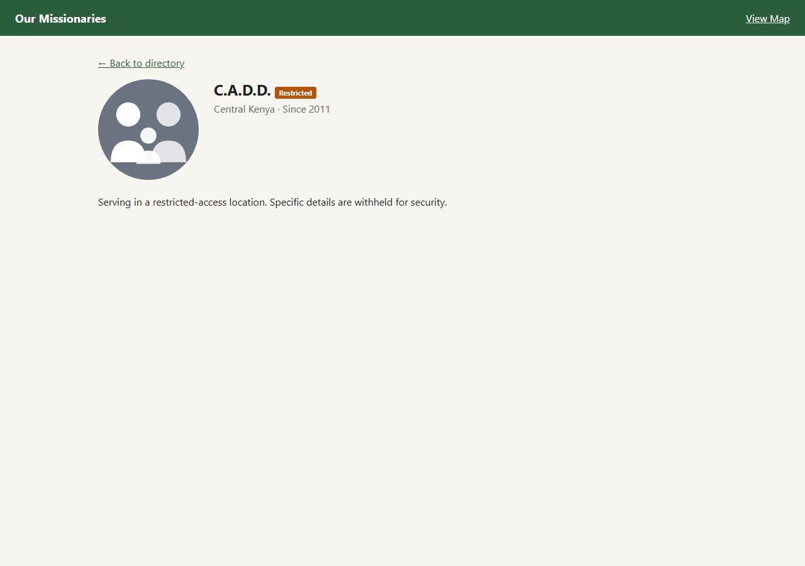

### Financial support & one-time needs

**Monthly Support** shows every partner with at least one support entry,
their current monthly amount, and a running total — archived partners
excluded unless you check "Include archived." Click a row to jump to that
partner. **+ Add Support Entry** logs a new amount against any partner
(the newest effective date is always what counts as "current"); each
row's **History** button expands to every entry on file for that partner,
with a **Delete** to remove one entered by mistake. There's deliberately
no in-place edit here — a support entry is a point-in-time record, like a
line in a ledger, so correcting one means deleting it and adding a new
entry rather than rewriting history.

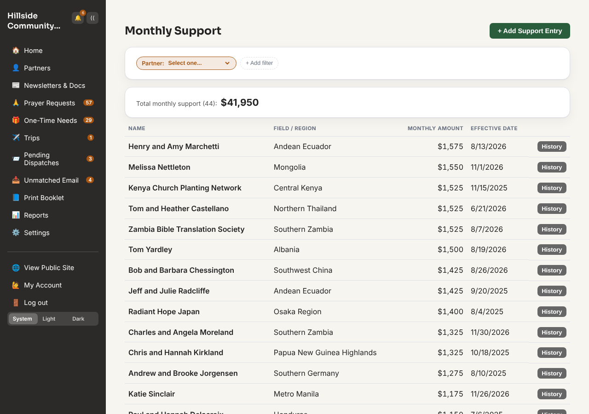

**One-Time Needs** lists every recorded need across all partners, with a
status pill (Pending Decision / Fully Funded / Partially Funded /
Declined) computed from the approved vs. requested amount. **+ Add Need**
adds one without leaving the page; an undecided need gets a **Record
Decision** button to fill in the approved amount/date once your church
has made a call, plus an optional **Decision Note** for why it came out
that way (a reason for declining, or for funding less than what was
asked). Both the requested amount (on creation) and the approved
amount/decision note (once decided) show up in the GroupMe post and the
admin email digest for that need — one-time needs never reach the
public digest, so there's no reason to hold that detail back from the
audiences that do see it. Both **+ Add Need** and its Edit form have a
**Source (optional)** dropdown listing that partner's newsletters and
documents — pick one if you read it yourself and typed the need in, or
leave it as "None." A need pointed at a source this way, or added
automatically by [AI Features](#ai-features-admin-only), shows a
"From: ..." link back to that file, rendered the same either way. For
marking a new need urgent, or (for a restricted partner) approving it at
creation instead of from Pending Dispatches, see [Marking something
urgent](#marking-something-urgent).

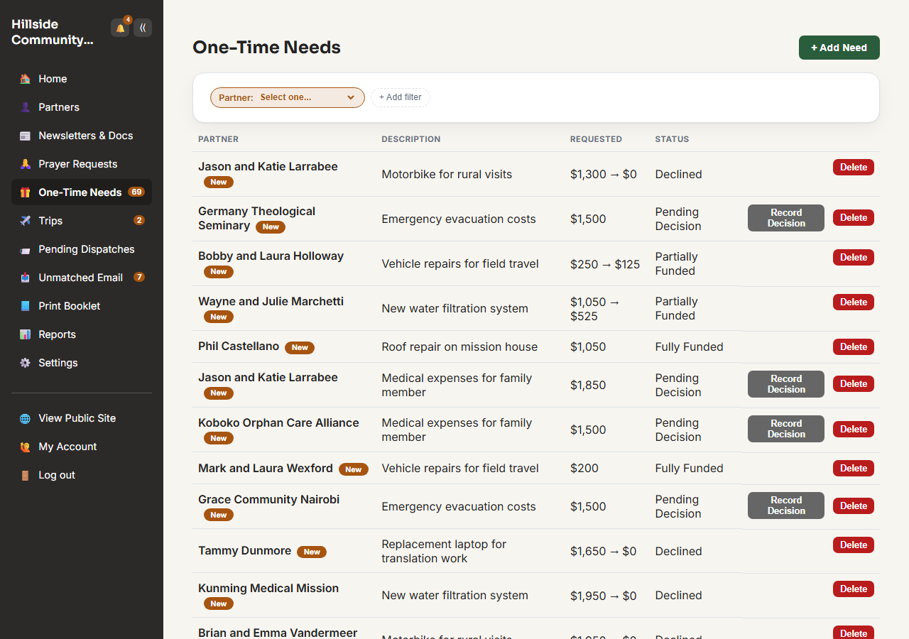

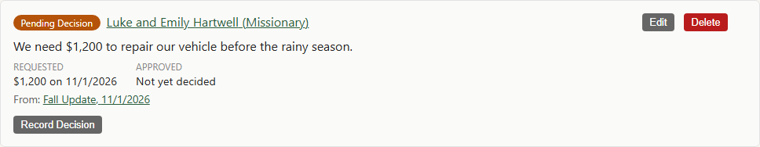

### Prayer Requests

Meant as a long-term record of what's been prayed for and how it was
answered — not a checklist. Add one from a partner's detail page or the
central **Prayer Requests** page (pick the partner, category, and the
request itself). **+ Add Prayer Request** and its Edit form also have a
**Source (optional)** dropdown listing that partner's newsletters and
documents — pick one if you read it yourself and typed the request in,
or leave it as "None."

- **Category** is **Strategic** (tied to the ministry's long-term vision
  or calling — church planting, discipleship, language study, funding —
  can optionally be shown on that partner's public profile via **Show on
  public profile**) or **Situational** (whatever came up — health,
  travel, family needs, paperwork; admin-only, never shown publicly
  regardless of any setting).
- A strategic request marked **Show on public profile** can also be
  checked **Include in printed booklet** — a separate setting, since a
  partner can build up more public strategic requests over time than
  would ever fit on a printed page. Only requests checked both ways ever
  appear in the booklet, and even then only up to the per-partner cap set
  on the [Booklet](#printable-partner-booklet) page (a handful, most recent first) — the
  rest still show on the public profile, just not in print. See
  [Printable partner booklet](#printable-partner-booklet) below.
- An open request just sits there — there's no "pending" or "unanswered"
  label anywhere in the app. Most requests, especially strategic ones,
  simply don't have a resolution yet, and that's normal, not a gap to
  flag. If you don't intend to follow up on a specific request for a
  formal answer (many situational ones), check **Not tracking this one
  for a specific answer** when adding it.
- When a request *is* answered, click **Record Answer** on it — the date
  and an optional note on how it was answered (shown as a quiet "✓
  Answered" line, never a colored badge). This is the part worth keeping
  long-term: a public strategic request's answer note shows on that
  partner's public profile and in the booklet too, right alongside the
  request itself — a real, growing record of how prayers actually get
  answered over time, not just a log of what's currently outstanding.

Separately from any individual request above, a partner's detail page
also has its own **Last Prayed For in a Service** field (a caption on
the field itself spells this out) — a record of the last time the whole
congregation prayed for that partner together during a worship service
or special church event, not any one request's own answer. Click **Mark
Prayed Today** right after it happens, or open the field to
enter/correct a past date if you're catching up on a few weeks of
history. It also shows up as its own column on the **Last heard from**
report (see [Reports](#reports) below), alongside last newsletter, last
photo, last prayer request, and last church visit — one more
connectedness signal when reviewing who's gone quiet.

The central **Prayer Requests** page lists every request across every
partner, filterable by category, with a running count of how many have
been answered so far. A request pointed at a source this way, or added
automatically by [AI Features](#ai-features-admin-only),
shows a "From: ..." link back to that file, rendered the same either
way. For marking a new request urgent, or (for a restricted partner)
approving it at creation instead of from Pending Dispatches, see
[Marking something urgent](#marking-something-urgent).

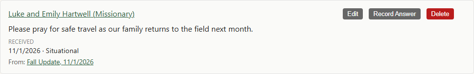

### Trips

Trips is a full recruiting/team/support-raising feature, not just a
historical log — off by default; turn it on in [Enabled
Features](ADMIN_GUIDE.md#feature-toggles) (and, separately, **Public
trip discovery** if you want trips listed publicly — see [ADMIN_GUIDE.md
§ Trips](ADMIN_GUIDE.md#trips) for exactly what each flag and each
private-link setting gates). One page, one "Trips" nav item, two tabs
each answering a different question:

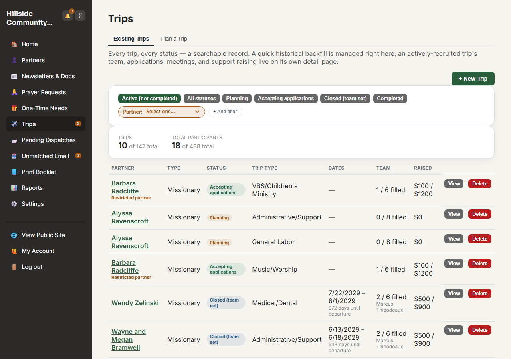

- The **Existing Trips** tab is the filterable log of every trip — filter by status,
  type, year, team size. It opens showing **Active (not completed)**
  trips by default (planning, accepting applications, and closed-but-
  not-yet-happened all count as active) rather than every trip ever —
  switch the Status filter to **All statuses** or **Completed** to see
  the rest; the two count tiles above the list always show the
  filtered count alongside the true all-time total (e.g. "6 of 103
  total") so neither number is mistaken for the other. **+ New Trip**
  offers an explicit choice: **Start recruiting a new trip** (pick a
  partner and trip type, then land on that trip's own detail page to
  fill in the rest) or **Log a trip that already happened** (the
  original backfill form — partner, dates, trip type, description, a
  Photo/Video Album link, and participants, without leaving the page).
  A trip that's only historical (`completed`) is managed entirely
  inline here, same as before this feature existed — **Edit**
  (everything except which partner it's under — delete and re-add to
  move a trip to a different partner) and **Delete**. A trip that's
  still `planning`, `accepting_applications`, or `closed` instead shows
  its status as a link into its own fuller detail page (below) — this
  list isn't where an active trip's applications, team, or documents
  get managed.
  - The **Album** link points to wherever you already host the trip's
    photos/videos — a Google Photos shared album, an iCloud Shared Album,
    or another provider you choose "Other" for. This app never stores the
    photos/videos themselves, just the link, and it's admin-only — it
    never appears on the public site.
- The **Plan a Trip** tab answers a different question — which partner
  to plan the *next* trip for — blending three kinds of row per
  partner so nobody falls off the list just because nothing's on the
  calendar yet: an **Open** row (already recruiting), a **Committed**
  row (team finalized, hasn't happened), or a **No trip scheduled** row
  (just that partner's own general trip capacity from their Trip
  Capacity fields). Each row also shows that partner's past trip
  count, and a **Clone trip** action to start a repeat from an existing
  trip's own setup instead of typing it all again. A restricted
  partner gets its own badge here too, name withheld — see
  restricted-partner handling below. Starting a brand-new trip works
  from either tab now — use whichever you're already on; Plan a Trip is
  still the better tool when you don't yet know *which* partner needs
  one.

**On a trip's own detail page**, beyond the basic setup fields (name,
dates, team size, description, visible-on-public-discovery toggle, and
**Collect parent/guardian info** for a trip that may have minors on
it):

The rest — team, requirements, meetings, budget, contributions,
applications, flight itinerary — lives on that same page's other tabs
(**Team**, **Meetings**, **Requirements**, **Financial**, **Flights**),
covered below.

- **Support-raising goal** shows a suggested per-person figure once a
  budget and a team size exist — always just a suggestion, never
  forced.
- **Flight itinerary** — once group travel is booked, enter each leg
  (airline/flight number, departs, arrives); shown only on each
  participant's own self-service page, never publicly.
- **Confirmed Team** is who's on the team, with each person's
  support-raising progress, one column per requirement showing who's
  completed it, and a link to their own detail page for everything
  else. **+ Add participant directly** adds someone without an
  application.
- **Trip-wide documents** are files shared with the whole team — an
  itinerary, a packing list — give one a title so it's clear what it
  is. Every team member can see and download these from their own
  self-service page, not just admins.
- **Requirements** — your own list of what's needed from each
  participant, each either a **document** to upload, a plain **task**
  to check off (e.g. "Attended orientation call"), or an
  **e-signature** the participant (or, choosing "Parent or legal
  guardian," a parent signing on a minor's behalf) signs from their
  own self-service page. A document-kind requirement can now be
  uploaded by the participant themselves from that same page too — not
  only by an admin. Fulfillment shows right on the Confirmed Team
  table, computed from what's actually on file or signed rather than a
  status anyone updates by hand. **Add from your saved requirements**
  picks a reusable one (like a minor travel release form) onto this
  one trip, instead of retyping it. Adding a document or e-signature
  requirement emails the whole current team — and anyone who joins the
  team later gets caught up on it automatically too, so nobody who
  joins after the fact is left not knowing something's expected of
  them.
- **Meetings** — schedule a date/time, an in-person location, a join
  link if it's virtual or hybrid, a **title**, and an agenda. The
  title is what shows in the invite's subject line and on the calendar
  entry — handy once a trip has more than one meeting, so they don't
  all just read "Meeting: <trip name>." Each meeting shows as a short
  summary (when, where, and who's RSVP'd); click it to see or change
  the details and who's responded. Scheduling one emails the team an
  invite right away (with a calendar attachment and one-click **Yes /
  No / Maybe** RSVP buttons they can click straight from the email, no
  login needed), and participants get a day-before reminder too, both
  showing the agenda and join link. Changing the time or join link
  resends the invite automatically; **Resend invite** sends it again on
  demand with no change needed. Someone added to the team after a
  meeting's already scheduled gets that meeting's invite the moment
  they join — nobody has to remember to resend it for them. Changing
  the trip's own start or end date resends everyone the updated
  calendar invite too. **Cancel** calls a meeting off and emails
  everyone who was invited — the meeting stays listed, crossed out, as
  a record that it happened and was called off.
- **Budget** (if turned on in Trips Settings) tracks estimated
  whole-team costs against what's been raised — admin-only, never
  shown to applicants or participants.
- **Contributions** is the giving ledger — who gave, how much, by
  Check/Cash/Online/Other, to whom it's credited.
- **Applications awaiting review** — click a row to open its own review
  page, with the applicant's full answers already shown. **Approve or
  Decline** there launches a short wizard (Decision, then Confirm); a
  declined one can still be reconsidered later.
- **Private application link** — a dedicated "Generate" button
  (appears only once **Allow staff to generate private application
  links** is on, under Settings → Trips Settings) creates a
  secret link you share directly — never listed anywhere, reachable
  even for a restricted partner's trip (masked, not blocked — see
  below). **Regenerate** immediately invalidates the old one.
- **Application questions** — add, edit, reorder, or remove questions
  specific to this trip, shown after the church-wide questions (set on
  Trips Settings) on both the public and private application form.
  Each is short text, long text, multiple choice, or checkboxes, with
  its own required toggle.

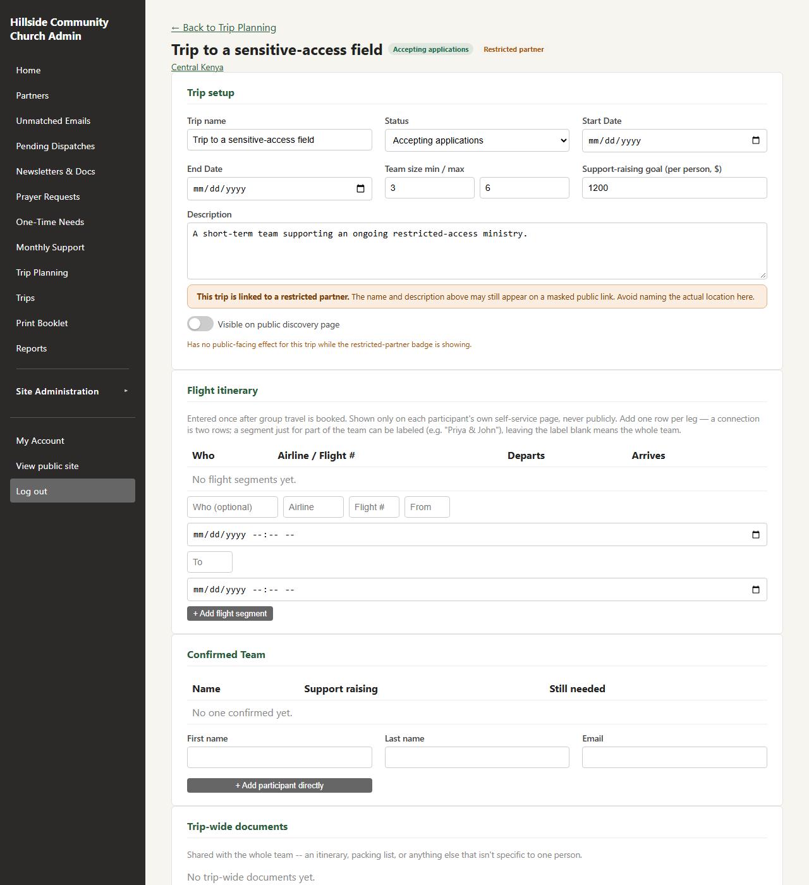

**A participant's own detail page** (click their name from Confirmed
Team) is where their contact info gets corrected, their public
support-raising page gets set up (photo, story), and their own
requirement fulfillment and documents live. **Request documents**
sends them an email asking for something specific.

**Settings → Trips Settings** holds everything church-wide
— donation instructions, whether to track a per-trip budget, the
application questions every trip shares plus a reusable saved-question
library, whether to collect an applicant's mailing address/emergency
contact/date of birth (date of birth has its own "require it" toggle
too), the default requirement checklist new trips start with plus a
reusable saved-requirements library (ships with a Minor Travel Release
&amp; Consent Form ready to use), and the two private-link toggles
above.

**Restricted-partner trips are never public, but aren't locked down to
"admin only" either** — three different rules depending on the
surface: fully excluded (behaves like it doesn't exist) from the
public Trip Opportunities listing and plain application links;
**masked** (the real partner never shown, a generic label instead,
same as elsewhere in this app) on a private application link or a
participant's support-raising link, since reaching either already
required someone to share a secret with you directly; and fully real
here on the admin detail page, with an amber warning reminding you
that the trip's own free-text name/description can still leak details
masking can't catch — avoid naming the real location there.

**What an applicant or participant sees, outside the admin UI**:

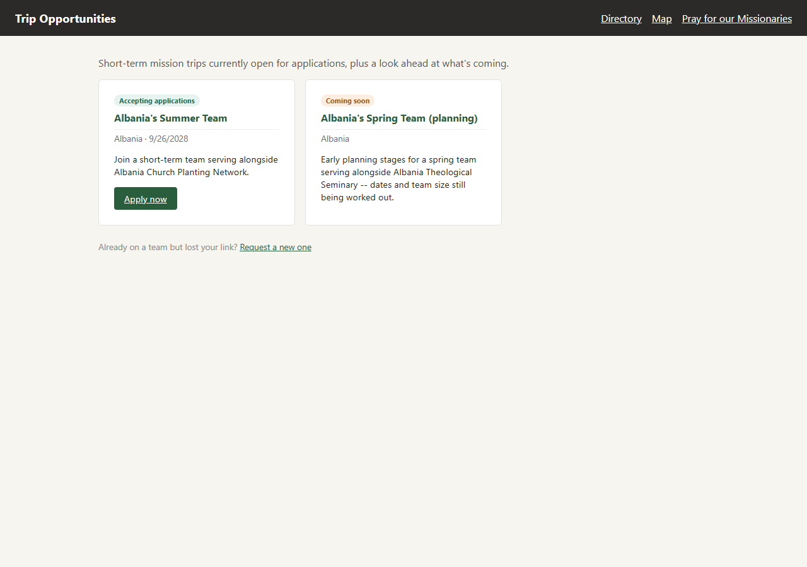

The public Trip Opportunities page (if that flag is on) lists what's
open, with a "Coming soon" teaser for anything still in planning; the
application form (below) renders whatever questions you've set up,
nothing hardcoded.

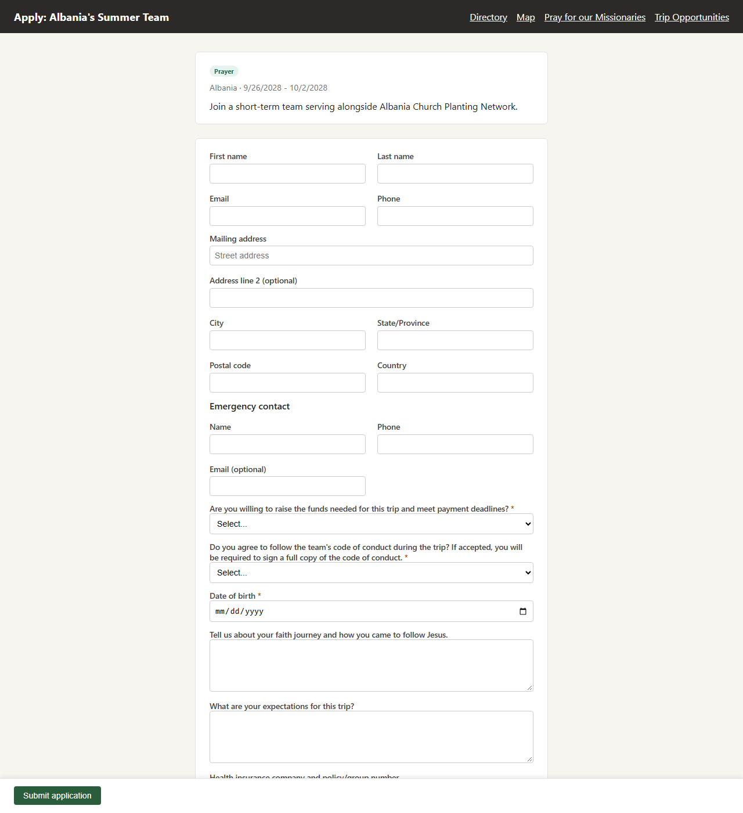

Once confirmed, a participant's own public support-raising page shows
their photo, story, progress toward their goal, and how to give —
never their flight itinerary or anyone's contact info.

Their own private self-service page (reached from their emailed access
link, not this public one) additionally shows the flight itinerary and
donor details, lets them edit their own story/photo directly with no
review step, and is where they fulfill a document or e-signature
requirement themselves. Each meeting listed there shows its title, an
**Add to calendar** link, and the same one-click Yes/No/Maybe RSVP
buttons the emailed invite has — right on the page, with "You
responded: X" once they've answered. Any trip-wide document (shared
with the whole team) is listed here too, with a link to download it.

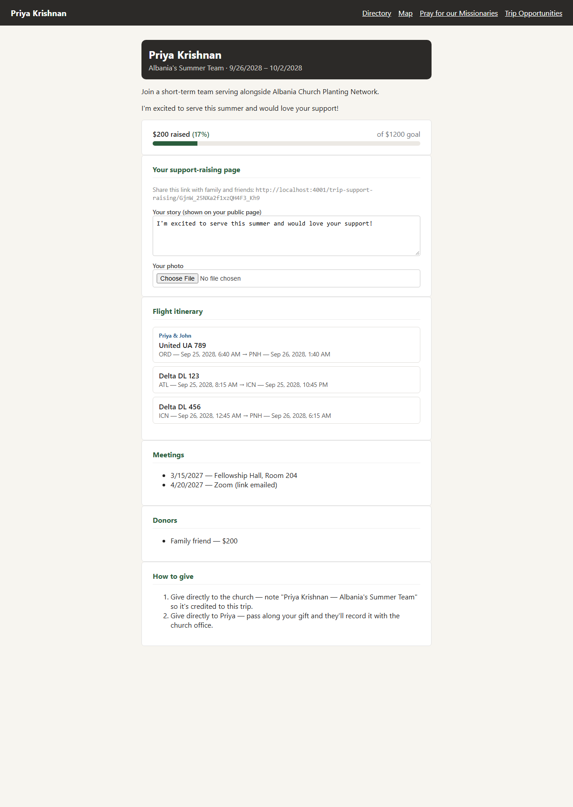

<!-- SCREENSHOT NEEDED: public-trip-self-service.png should be retaken
to show the new Meetings (title + Add to calendar + inline RSVP),
Trip-wide documents, and self-upload-a-document pieces described above
-- same flag as ADMIN_GUIDE.md. Tracked alongside #264/#266. -->

If they lose their self-service link, a **request a new link** page
always replies the same way whether or not it found anything, so it
can't be used to check whether someone has a trip record at all.

### Newsletters & Docs

One place for every file a partner sends — a newsletter update, a
completed survey, a returned signed policy acknowledgment, an email
worth keeping on file long-term, or any other document — distinguished
by a single **Kind** field rather than separate newsletter/document
systems to choose between:

| Kind | For |
|---|---|
| Newsletter | A ministry/prayer update — what most uploads actually are. |
| Survey Response | A completed survey or check-in questionnaire sent back by the partner. |
| Signed Policy | A policy acknowledgment (child protection, code of conduct, etc.) signed and returned. |
| Email Communication | An email exchange worth keeping on file long-term. |
| Office Document | A Word/Excel/PDF document that doesn't fit the other kinds. |
| Other | Anything else — pick this and type your own label (e.g. "Background Check"). |

Upload from the central **Newsletters & Docs** page (**+ Upload File**:
pick the partner, choose a file — PDF, Word `.doc`/`.docx`, Excel `.xls`/
`.xlsx`, `.eml`, JPEG, or PNG — pick a Kind, optional title/notes) or
directly from that partner's detail page, which embeds the same
upload/view/delete UI. The central page can filter by Kind and by
missionary/organization, so you can, for example, pull up every signed
policy on file across all partners at once. **View** opens the file in a
new tab; **Edit** lets you fix everything but the uploaded file itself —
Kind, title, received date, notes, and (from the central page only)
which partner it's filed under — so reclassifying a mis-filed upload is
just an edit, not a delete-and-reupload. Files here are always private —
never shown on the public site, regardless of the partner's `isPublic`
flag.

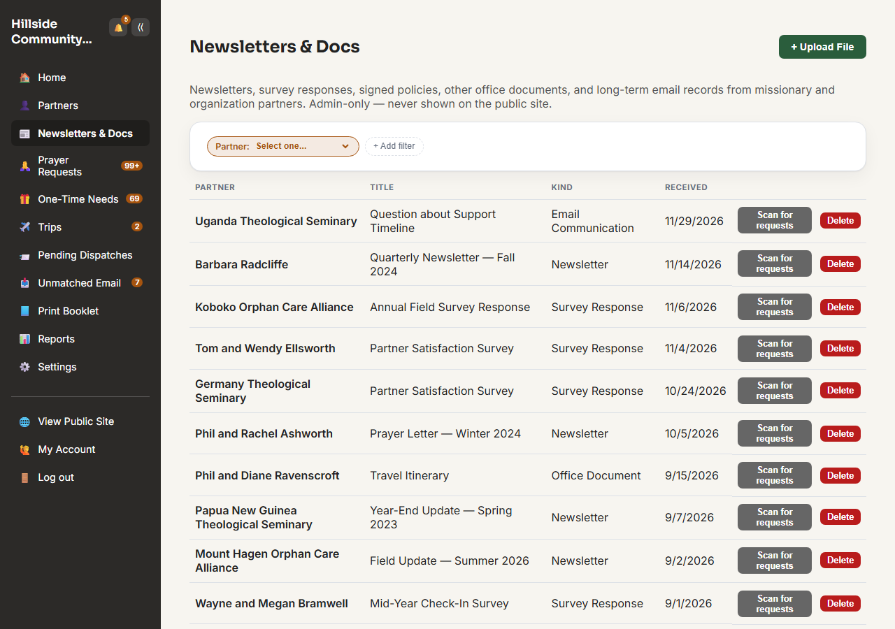

### Printable partner booklet

**Print Booklet** builds a print-formatted directory: pick a **Look &
Feel** template — Classic (warm accent-colored circles and a soft tinted
callout, with a circular photo) or Modern (clean and structured, no
decorative shapes, bold accent rules, and a rectangular photo) — choose
who's included (archived, restricted-access, organizations), and what
shows on each page (photo, overview, location, address, family info,
sending church/org, and an optional facing **Notes & Prayer Page** with
ruled lines for the reader's own handwritten notes). Both templates'
accent color defaults to your church's own brand color (**Primary
Color** in [Church Settings](#church-settings-admin-only)); an instance
that hasn't set one falls back to a fixed four-color rotation instead.
Turning on **Prayer Requests** also turns on, and locks on, that facing
page — a partner's public [prayer requests](#prayer-requests) marked
**Include in printed booklet** print at the top of it, not on the main
page itself (an "answered" one includes its note, an open one doesn't
call out its status at all, same as everywhere else in the app), with
the ruled lines below them; the Notes & Prayer Page can still be turned
on by itself, with no prayer requests, for a facing page that's just
that partner's name and blank ruled lines. With Prayer Requests on, a
**Max prayer requests per partner** field caps how many print for any
one partner (most recent first) so a partner with a long history
doesn't crowd out the rest of their page. Set a cover title/subtitle.
Every booklet also ends with a closing back cover — your church's logo,
name, mailing address, phone, and website (all from
[Church Settings](#church-settings-admin-only)). The preview on the page
re-renders live as you change any option; **Print Booklet** opens your
browser's own print dialog on that same paginated preview — useful for
printing a physical prayer/support directory for your congregation.

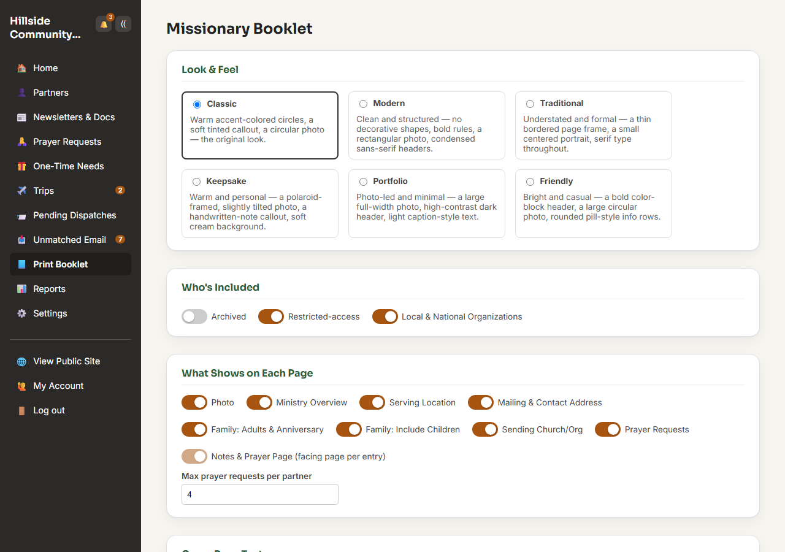

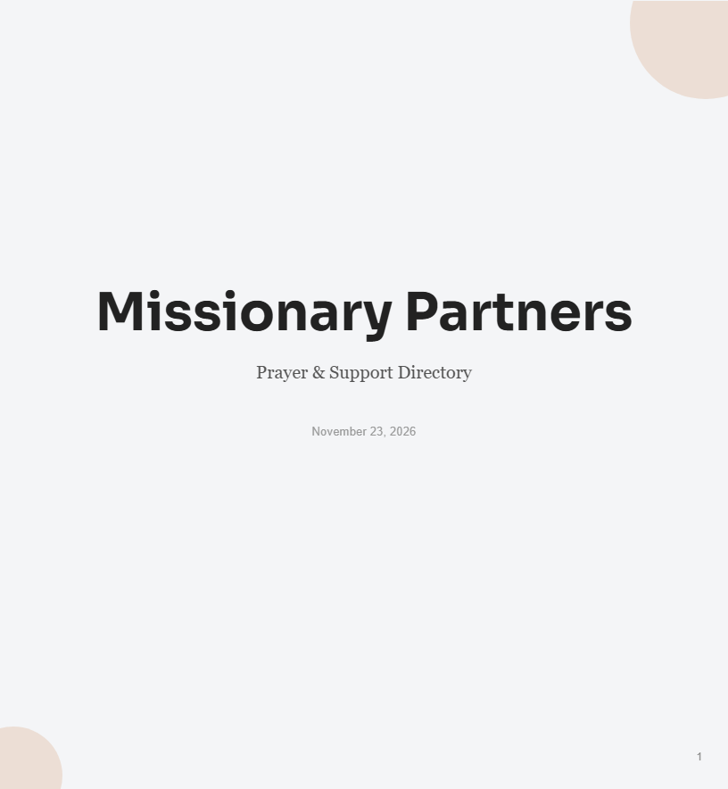

### Reports

A hub organized by the question you're actually asking, not a flat list
of report names. **Reports** opens a page of groups — **Money**,
**Partner care**, **Partners & relationships**, **Upcoming**, **Trips**,
**Coverage**, **Communication**, **Contacts**, **System** — each showing
the reports under it as a plain question ("What monthly support has the
church committed, and to whom?", "Who is still missing a requirement
before departure?"). Click a question to open that report.

Every report page works the same way: set its filters (each one is
reflected in the URL, so a link to a filtered view can be bookmarked or
shared), click **Run report**, and read the summary tiles above the
table for the headline numbers before scanning rows — some tiles are
themselves clickable, filtering the table to just that slice. Results
export as **Download CSV** (same rows and columns as the screen) or
**Print** (a clean paginated layout for handing to a meeting).

The current reports, by group:

| Group | Reports |
|---|---|
| Money | Support summary · Support changes |
| Partner care | Prayer requests · One-time needs · Data completeness |
| Partners & relationships | Partner roster & tenure · Last heard from |
| Upcoming | Families & key dates |
| Trips | Trip fundraising · Trip readiness · Application funnel |
| Coverage | Language coverage · Where we serve |
| Communication | Dispatch health |
| Contacts | Mailing list |
| System | Users & access (admin only) |

A report tied to a feature that's turned off (see
[ADMIN_GUIDE.md § Feature toggles](ADMIN_GUIDE.md#feature-toggles))
simply doesn't appear in the hub.

**Saved views** on a report's own page let you save a set of filters by
name — **private** (only you see it) or **shared** (everyone with access
to Reports sees it) — and apply it again later with one click instead of
re-setting every filter. An admin can turn any saved view into a
**scheduled report email**: pick weekly, monthly, or quarterly, and it's
emailed with that view's filters already applied to the recipients you
choose, masked the same way the screen is for a restricted partner.

## Settings

### Church Settings (Admin only)

One record controls the whole instance's branding, on one **About &
Branding** page under Settings, split into two sections — changes on
either take effect immediately, everywhere, with no code changes
needed:

- **About Church** — Church Info: name, phone, contact name/email,
  website, and address. This is also what auto-fills "Sent by our church"
  on the missionary form. Right after saving a change here, if any
  partners are marked "Sent by our church," a prompt appears showing how
  many and offering to **update them all with this info** — a one-click
  bulk overwrite of every such partner's Sending Church section, for
  keeping everyone in sync after an address or contact change. It's
  deliberate, not automatic: saving About Church alone never touches any
  partner on its own.
- **Branding** — Public Site (tagline, about text, three independent
  colors, plus a font choice), Logo, and Partner Terminology (swap
  "Missionary" for whatever your church calls them, and optionally use
  that term in the admin nav too). Each color controls a different part
  of the app, so a church can genuinely style itself rather than
  tinting everything the same shade:
  - **Header Color** — the header bar and the admin sidebar background.
  - **Accent Color** — buttons, links, headings, and report
    letterheads — the color people actually associate with the church.
  - **Highlight Color** — hover, focus, and active/selected states, e.g.
    a button on hover or the current nav item.

  All three also flow into the [email digest](#digest-customization)'s
  Snapshot layout and its masthead/buttons, so the digest looks like the
  same product as the rest of the site, not a separately-styled email.
  **Reset to Default** clears all three colors and the font back to the
  built-in look in one click; changing nothing leaves every surface at
  its current built-in default, the same visual look as before this
  feature existed.

### User management (Admin only)

**Manage Users** lists everyone with access — email, role, active status,
MFA status, last login. **+ Add User** opens its own page: email, name,
role (Admin, Editor, Viewer, or Trip Leader — pick a trip to scope a Trip
Leader to), then how they'll get access — **Send a welcome email** (on
by default) emails them a one-time "Choose your password" link so you
never type or see their password; **Require two-factor authentication at
first sign-in** can be turned on at the same time. If outbound email
isn't set up, the setup link is shown right there on the page instead, to
copy and send however you like. Turn the welcome email off to set a
password yourself (or leave it blank and use **Send setup link** on their
row in Manage Users later) — either way, every account is still email +
password once set up, per [Logging in](#logging-in) above. A setup link
expires after 72 hours (7 days for a Trip Leader); their account stays
pending — visible in Manage Users, but unable to sign in — until a
password is actually set.

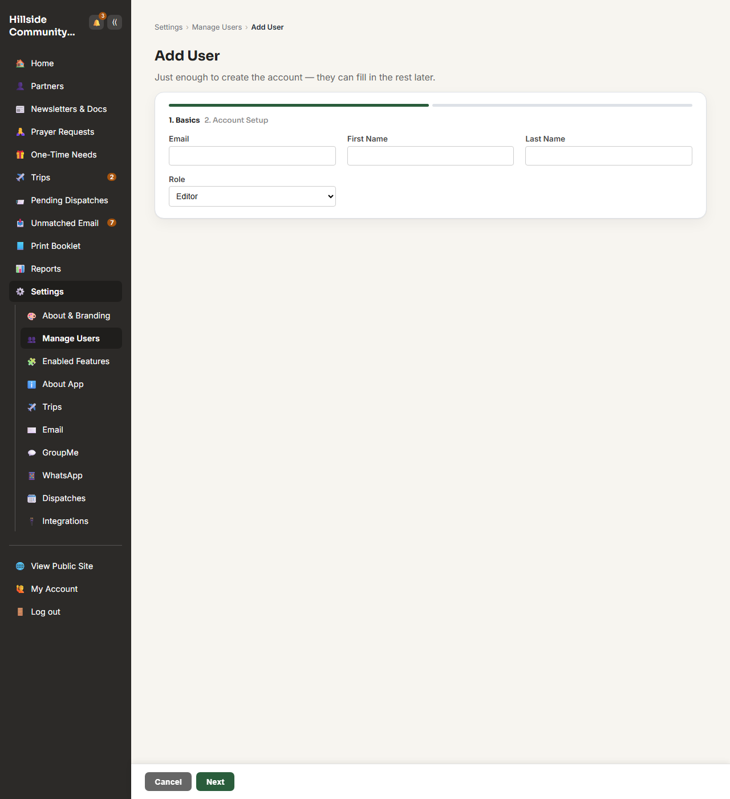

Editing an existing user (from their row in Manage Users) lets you change
role, deactivate, force MFA enrollment, or reset a password. **Reset MFA**
clears a locked-out user's two-factor setup so they can log back in with
just their password and re-enroll — for your own account, use **Disable
Two-Factor Authentication** on [Your account settings](#your-account-settings)
instead, which requires your current password; **Reset MFA** on your own
row is blocked here, since skipping that password check is exactly how a
hijacked session could silently strip your own two-factor protection.
You can't delete your own account, and the app won't let you demote,
deactivate, or delete the last active admin — there's always at least
one way back in.

### Database Backups (Admin only)

**Backups** is a section of the **About App** page under Settings
(formerly its own nav item, now folded in alongside System Info below —
same page, scroll down). Any admin can download a full backup of
everything in the database — every partner, user, and uploaded file —
as a single file, on demand, with no setup required. Nothing is kept
server-side; the download is the only copy, so save it somewhere safe
right away. The file is unmasked and highly sensitive (restricted
partners' real data, password hashes, encrypted two-factor secrets) —
treat it accordingly. Restoring one is a deliberate command-line step,
not a button — see
[ADMIN_GUIDE.md § Database backups](ADMIN_GUIDE.md#database-backups) for
the full runbook.

The same section also has a periodic reminder banner (asking you to
confirm your database provider's own backups are working) with an
explicit, permanent opt-out for a church that's already confirmed that
elsewhere — checking that box requires a deliberate save, not just a
casual dismiss.

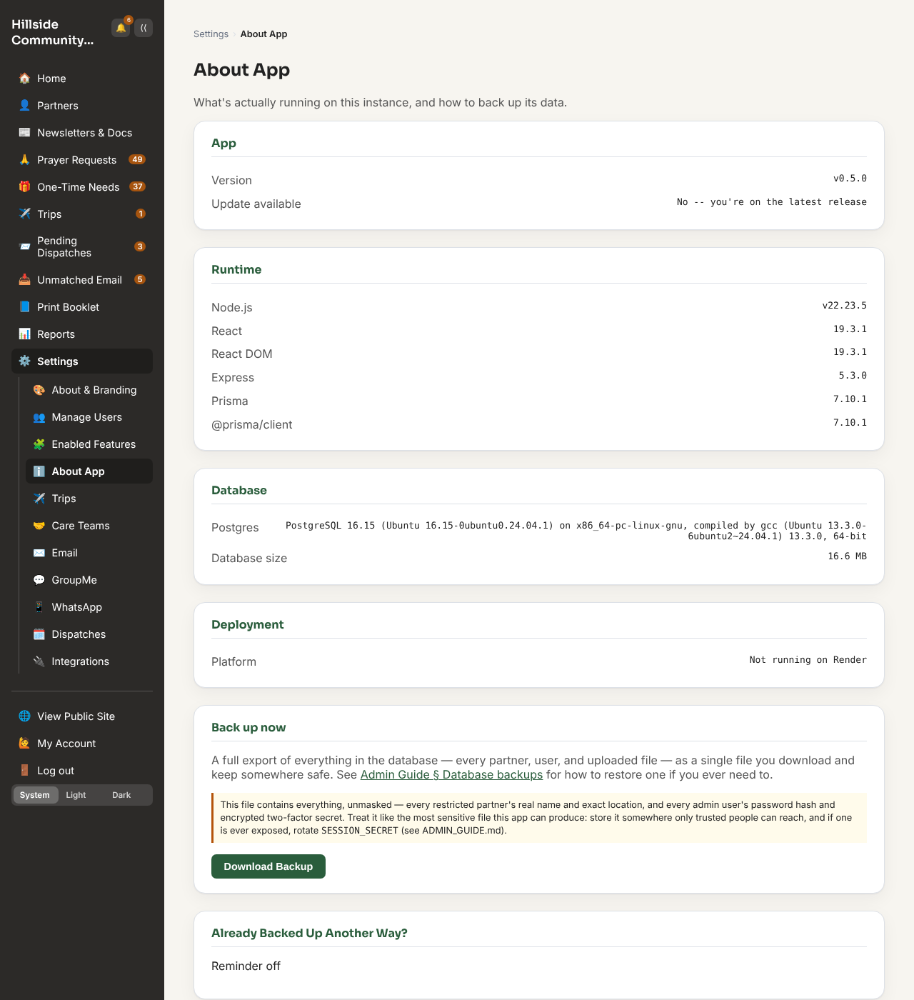

### System Info (Admin only)

**System Info** is the top section of the same **About App** page
(Settings → About App) — a read-only view of what's actually running on
this instance: the app version (plus the same "update available" check
the dashboard banner already does), Node.js/React/React DOM versions,
the Postgres version and database size, and — when running on Render —
the service name, git commit, and external URL. Useful for confirming
what you're on before filing a bug, without needing shell access. Never
shows a connection string or any credential.

## Communications

### GroupMe dispatch (Admin only)

Posts new prayer requests, one-time needs, and newsletters to GroupMe so
a team sees them without checking the admin dashboard. A prayer request
getting **Record Answer**ed or a one-time need getting **Record
Decision**ed posts too — the original ask alongside the outcome, into
that same type's topic, no separate setup. Off by default — turn it on
in [Enabled Features](ADMIN_GUIDE.md#feature-toggles) once it's set up
here.

These don't post the instant they happen — GroupMe has its own daily
batch time (set on the Dispatch Settings page), and an item marked
**urgent** posts right away regardless of that schedule — see [Marking
something urgent](#marking-something-urgent). See [Pending
Dispatches](#pending-dispatches) for the queue itself, and
[Dispatch Settings](#dispatch-settings-admin-only) for the
schedule.

Setup, on the **GroupMe** page under Settings, builds up in
steps:

1. **Access Token** — paste a personal access token from
   [dev.groupme.com](https://dev.groupme.com). Messages post under that
   account's own GroupMe identity, not a bot — write-only once saved,
   same as a password field; leave it blank on a later save to keep the
   existing one.
2. **Group** — click **Load My Groups** to pull the token's actual
   GroupMe groups, pick one, **Use This Group**.
3. **Topics** — click **Load Topics** once to pull that group's real
   Topics. The three sections below (**Prayer Requests Topic**,
   **One-Time Needs Topic**, **Newsletters Topic**) all share that same
   list — pick a topic and **Use This Topic** for whichever dispatch
   types you want; skip any you don't. Until a topic is picked for a
   given type, that dispatch posts to the group's main conversation
   instead.

If GroupMe itself is unreachable or rejects a post, whatever you were
saving — a prayer request, a one-time need, a newsletter, an answer, a
decision — still saves normally; it just queues for the next send
attempt. The dispatch is best-effort and never blocks your own work.

The newsletter dispatch includes a direct link to the letter (the
same link **View** opens on the newsletter's own page) — this only
appears once `APP_BASE_URL` is set, or automatically on Render (see
[ADMIN_GUIDE.md § Environment variables](ADMIN_GUIDE.md#environment-variables)).
Whoever clicks it needs to be logged into the admin dashboard, same as
any other admin link.

Once it's sent, a prayer request, one-time need, or newsletter shows up
in its own configured Topic within the GroupMe app itself, same as any
other message, with the full request/need text (not a summary) and
several queued items packed into as few messages as fit GroupMe's
1,000-character limit:

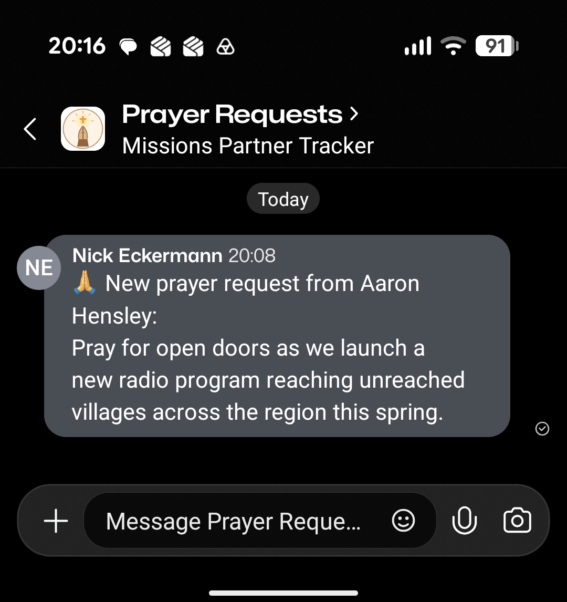

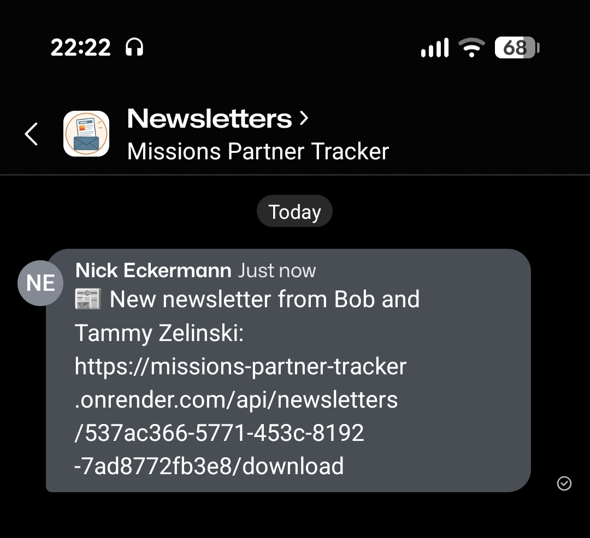

### WhatsApp dispatch (Admin only)

Posts the same new prayer requests, one-time needs, and newsletters to
WhatsApp — each type to its own group inside one WhatsApp community.
It's an alternative or addition to [GroupMe](#groupme-dispatch-admin-only):
a church can use either or both. Off by default — turn it on in [Enabled
Features](ADMIN_GUIDE.md#feature-toggles), then set it up on the
**WhatsApp** page under Settings (it only appears once the
feature is on). **Read [ADMIN_GUIDE.md § Dispatch:
WhatsApp](ADMIN_GUIDE.md#dispatch-whatsapp) first** — this is an
unofficial connection and you'll want a dedicated phone number for it.

WhatsApp sends once a day, at an admin-set hour, and has its own three
content-type mutes (Prayer Requests / One-Time Needs / Newsletters) —
both set on the [Dispatch Settings](#dispatch-settings-admin-only)
page. GroupMe shares that same daily-hour field and the same three
mutes, because both are chat-style, near-real-time channels — not
because WhatsApp depends on or borrows GroupMe's settings — but
WhatsApp's own on/off state, community/group configuration, and
delivery are entirely its own; turning GroupMe off, or it being
unreachable, never affects WhatsApp. An item marked **urgent** posts
right away. Items waiting for the same group go out together in one
message.

Setup builds up in steps:

1. **Link the number** — click **Show QR Code**. On the dedicated phone
   open WhatsApp → Settings → Linked Devices → Link a Device, and scan
   the code shown. The page shows whether the number is connected, and
   warns if WhatsApp has flagged it. **Unlink Number** removes it and
   clears your choices below.
2. **Community** — once connected, **Load My Communities**, pick yours,
   **Use This Community**. The number must already be a member. The
   community's built-in **Announcements group** is detected
   automatically at this point (no picker for it — it's shown read-only)
   and works the same way GroupMe's main conversation does: it's where a
   dispatch type with no group of its own posts instead.
3. **Groups** — **Load Groups** once to pull the community's real groups,
   then pick a group and **Use This Group** for each of **Prayer
   Requests**, **One-Time Needs**, and **Newsletters** you want. A type
   with no group of its own picked posts to the Announcements group
   instead; only if neither is set does it not go out over WhatsApp at
   all. Picking a different community clears the group picks and
   re-detects the new community's Announcements group.

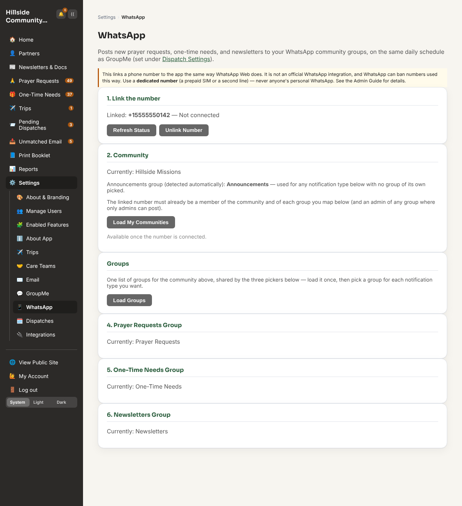

If WhatsApp is disconnected or rejects a post, whatever you were saving
still saves normally; the dispatch stays queued and goes out on the
next send.

What a church's members actually see once messages go out — a Prayer
Requests group with new and answered requests, and a One-Time Needs
group with new and decided needs:

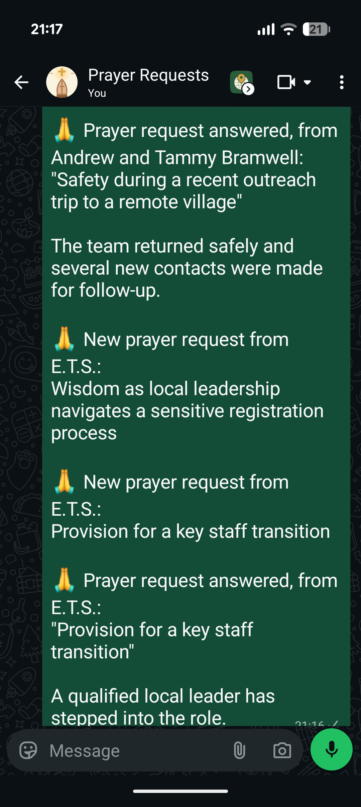
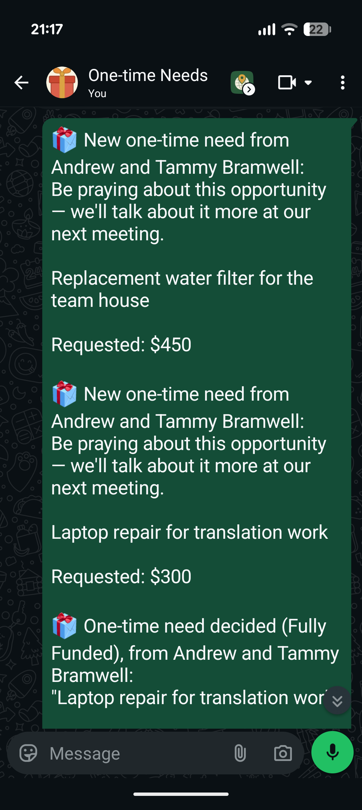

### Pending Dispatches

The **Pending Dispatches** page (in the main menu, alongside
Unmatched Emails) is where every prayer request, one-time need, and
newsletter queues before going out — the shared review-and-send queue
behind both GroupMe dispatch above and email digests below. Only
shows up once GroupMe dispatch or Email (Sending) is turned on —
no point reviewing a queue neither channel will ever read. Visible to
any logged-in role; only an admin or editor can actually edit, approve,
or clear an item. For the schedules, GroupMe's content-type mutes, the
restricted-partner safety gate, and email dispatch appearance, see
[Dispatch Settings](#dispatch-settings-admin-only) below.

The list shows everything currently queued, grouped by partner, with a
prayer request or need that came from a newsletter nested right under
that newsletter instead of repeated separately. There's no manual
"send everything now" button here — for a specific item that needs to
go out right away, check **urgent** on it when you create it instead,
see [Marking something urgent](#marking-something-urgent).

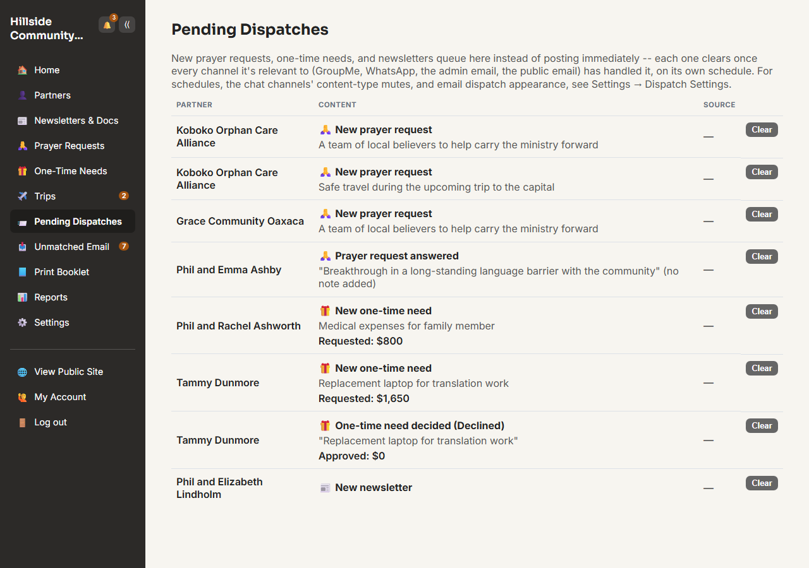

A queued item only clears once every currently-enabled channel has
actually sent it — if GroupMe is down but email goes out fine, that item
stays queued and only retries GroupMe next time, rather than going out
to email twice.

A partner marked **Restricted-access** (see [Understanding
restricted-access partners](#understanding-restricted-access-partners))
shows a **Restricted** badge on its queued items here, and its name,
photo, and any source link are masked the same way they are everywhere
else a restricted partner appears, regardless of anything below.

**Editing any item.** Every queued item has an **Edit** button — opens
the real (unmasked) text in a small editor, for a quick wording fix
before it goes out. Saving takes effect on that item's next send; it
has no effect on *whether* an item is eligible to send, except for a
held item (next).

**Reviewing a restricted partner's request or need.** A restricted
partner's prayer request or one-time need — new, answered, or decided
— can't send on any channel, on schedule or urgent, until an admin or
editor reviews it. Marking something urgent (see [Marking something
urgent](#marking-something-urgent)) doesn't skip this — it still shows
the amber **Awaiting review** badge and stays held until cleared, the
same as it would without the urgent checkbox.

The real (unmasked) text shows right there on the row itself, not a
generic placeholder — the structural masking above (name, photo,
source link) is the actual protection here, not the wording, so there's
nothing gained by hiding it in this one list when [Prayer
Requests](#prayer-requests) and [One-Time
Needs](#financial-support--one-time-needs) already show it to anyone
logged in regardless of role. Clear the hold one of three ways:

- **Approve** — confirms the text already shown on the row and clears
  the hold in one click, with nothing to edit.
- **Edit**, then **Save and Approve** (the Save button's label when the
  item is held) — edit the wording first, confirm, and save; the hold
  clears at the same time.
- **Review and approve now**, checked while creating the request or
  need in the first place, instead of coming back here at all — see
  [Marking something urgent](#marking-something-urgent).

Any of the three, the confirmation prompt repeats the exact text that's
about to become sendable and asks you to check it for anything else
that could identify the partner or their location before confirming —
the structural masking above (name, photo, source link) stays in
effect regardless, but the wording itself is otherwise sent as-is.
Once reviewed, the item is eligible for the next send like any other
queued item; editing it again later overwrites what was previously
reviewed.

The **Pending (N)** heading shows a note when any items are being held
this way.

Any item, restricted or not, reviewed or not, can be removed from the
queue without sending it with the **Clear** button on its row.

### Marking something urgent

A **Mark as urgent** checkbox is available to admins and editors when
creating a prayer request or one-time need (not when answering/deciding
one, and not for newsletters — there's no form to check it on). It only
appears once at least one dispatch channel is actually turned on;
with GroupMe and Email (Sending) both off, there's nothing for it to
reach, so it isn't offered at all rather than doing nothing silently.

Checking it and saving sends that item immediately — to GroupMe, to
admins, and to confirmed public subscribers, whichever of those your
church currently has turned on — bypassing everyone's own chosen
schedule. You'll see a confirmation naming the real number of admins
and public subscribers about to be notified before it actually sends.

What it doesn't bypass: a restricted partner's item still waits on
review exactly as it would without the checkbox (see [Reviewing a
restricted partner's request or need](#pending-dispatches) above),
and a muted GroupMe content type still blocks that one channel — urgent
only skips waiting for a schedule, never either of those safety rules.

**Review and approve now.** For a restricted partner specifically, a
second checkbox appears alongside "Mark as urgent": **Review and
approve now**. Checking it confirms, right then, that the text you just
typed is safe to send out exactly as written — the same confirmation
[Pending Dispatches](#pending-dispatches)'s own **Approve** does,
just at creation time instead of a second visit later. It clears the
review hold; it doesn't by itself make anything send immediately — that
still needs "Mark as urgent" too, or whatever channel's own regular
schedule picks the item up next.

### Dispatch Settings (Admin only)

The **Dispatch Settings** page under Settings → Communications
holds every schedule, the chat channels' (GroupMe and WhatsApp) shared
content-type mutes, the one restricted-partner safety gate, and the
email dispatch's own appearance —
separate from the actual queue above, same split Email already has
between its own settings page and Unmatched Emails. Top to bottom:

#### Email Dispatch Subscribers

A read-only section at the top of the page (only shown once [Public
prayer digest](ADMIN_GUIDE.md#feature-toggles) is turned on) showing
how many admins are subscribed to the digest from their Account
Settings, how many public visitors have confirmed their subscription,
and how many are still waiting on their confirmation email. Counts
only — no email addresses, here or anywhere else an admin can see.

#### Restricted Partners

One checkbox, off by default: turned on, a restricted-access partner's
prayer requests and one-time needs are recorded and can reach GroupMe,
WhatsApp, and both email digests, subject to the review requirement described in
[Pending Dispatches](#pending-dispatches) above. Left off (the
default), their events are never recorded in the first place, for any
type — nothing to hold, nothing to review, because nothing's queued.
Turning it on takes on that review responsibility in exchange for
restricted partners' content reaching every channel like anyone else's.

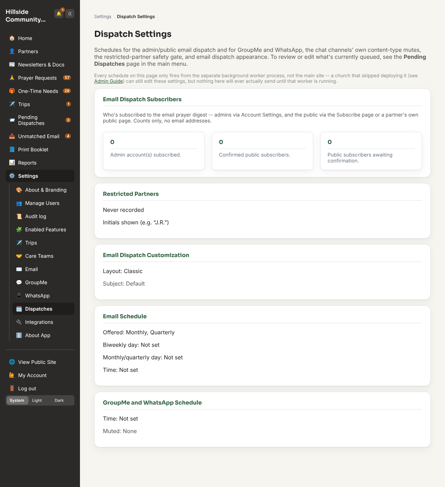

#### Email Dispatch Customization

Everything here controls the **email digest specifically** — GroupMe
and WhatsApp's own message format doesn't change, since both are
plain text and have no layout/subject/signature of their own to
customize:

- **Layout** — **Classic** (plain text-only partner cards) or
  **Snapshot** (adds each partner's photo — or a generic silhouette if
  they don't have one, or if they're restricted-access — field, how long
  the church has supported them, and a short overview above their
  items). Classic is the default; switching to Snapshot doesn't change
  what's masked for a restricted partner, only how the rest of the card
  looks.
- **Subject line** — leave blank for the default
  (`{date} {church} - {term} Updates`), or write your own using any of
  `{church}`, `{month}`, `{year}`, `{date}`, `{cadence}`
  (Biweekly/Monthly/Quarterly), `{name}` (the recipient's own name), and
  `{term}` (the Partner Terminology set on
  [Branding](#church-settings-admin-only)).
- **Signature** — an optional closing line (a verse, "Questions? Contact
  us," etc.) shown above the unsubscribe link.

Below are the same batch of items from the Snapshot example rendered as
both an actual email, Classic on the left and Snapshot on the right, so
you can see exactly what changes between the two before picking one.

| Classic | Snapshot |
| --- | --- |
| 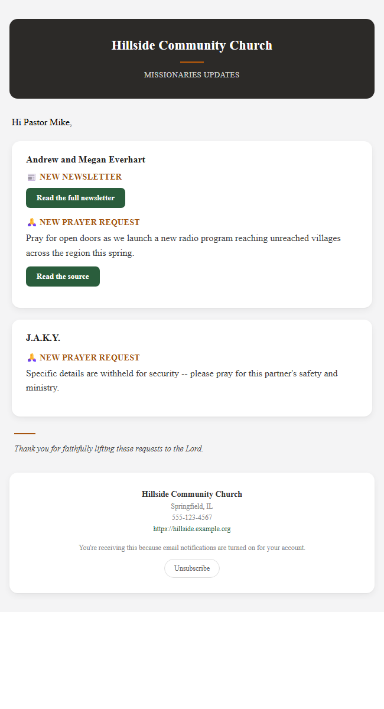 |  |

The layout choice above is shared by both audiences, but what each one
actually *receives* isn't — a public subscriber's email only ever
includes prayer requests, with no source link and no one-time-need
amount, regardless of layout. See [ADMIN_GUIDE.md § Dispatch:
GroupMe, the admin digest, and the public
digest](ADMIN_GUIDE.md#dispatch-groupme-the-admin-digest-and-the-public-digest)
for a side-by-side example of the same batch of events rendered for
each audience.

#### Email Schedule

The one shared schedule for both the admin digest and the public
digest — each admin picks their own cadence on their own [Account
Settings](#your-account-settings) page, and each public subscriber
picks theirs when they follow a partner or use the Subscribe page (see
[§ The public site](#the-public-site)); this is what actually makes
either cadence send. Set a day of week (biweekly), a day of month
1–28 (monthly and quarterly share this field), and a time shared by
all three — each tier only fires once its own day/time is set; leaving
all three unset (the default) means nobody's individual cadence choice
ever actually sends, regardless of what they picked for themselves.

This section also has a checkbox for each of the three tiers, deciding
whether it's even offered on the two cadence pickers above (biweekly
starts off, monthly and quarterly start on). Unchecking one moves
anyone currently on it to the first tier still checked, in order
Monthly, Quarterly, Biweekly — immediately, not reversibly; re-checking
the tier later doesn't move anyone back. At least one tier has to stay
checked.

#### Chat channels (GroupMe & WhatsApp)

One shared daily-hour field and three shared mutes, used by whichever
chat channel(s) are on (see [GroupMe dispatch](#groupme-dispatch-admin-only)
and [WhatsApp dispatch](#whatsapp-dispatch-admin-only) above for each
channel's own connection setup, on its own page):

- **Time** — a single daily hour. GroupMe and WhatsApp are both
  near-real-time chat channels, not a periodic email, so there's no
  weekly/monthly tier here — whatever's queued for either one gets
  packed into as few messages as fit and posted once a day, at
  whichever hour you set. One field, shared by both — there's no way
  to give them different hours.
- **Mute Prayer Requests / One-Time Needs / Newsletters** — three
  independent checkboxes, shared by GroupMe and WhatsApp. Muting one
  just stops *that type* from posting to either chat channel; it never
  affects whether that type gets recorded at all, so the email digest
  and the restricted-partner review queue are completely unaffected by
  any of these three.

### Email (Admin only)

One **Email** page under Settings, with two independent
halves — **Sending** and **Receiving** — each with its own on/off switch.
Both go through [Postmark](https://postmarkapp.com), a dedicated email
delivery service, not through this church's own Gmail or Microsoft
account. See
[ADMIN_GUIDE.md § Email (Postmark)](ADMIN_GUIDE.md#email-postmark) for
why. Turn on just the one you actually use — a church that only wants
the digest doesn't need Receiving on, and vice versa.

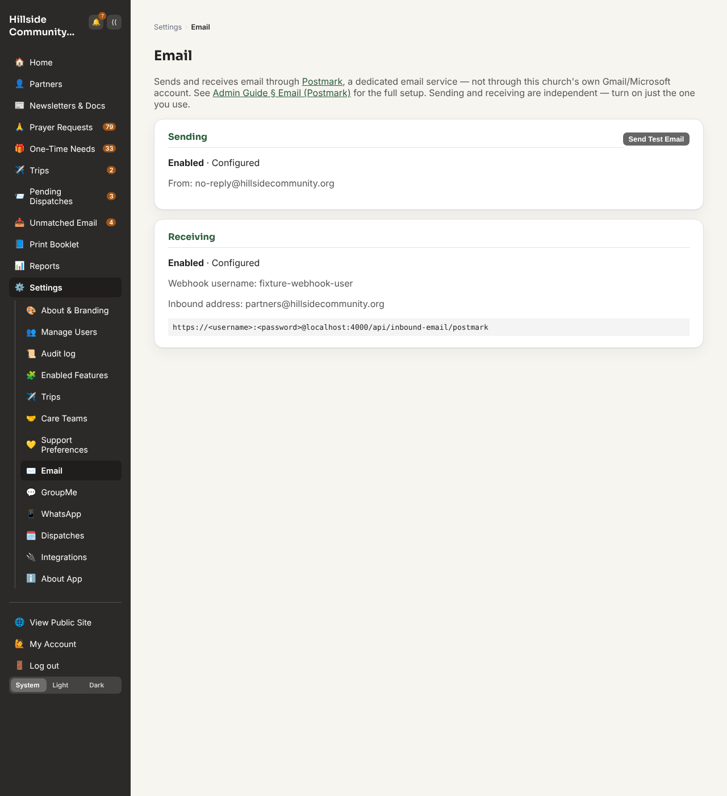

#### Sending

Once turned on, this is the email half of the
[Pending Dispatches](#pending-dispatches) queue above — an
opted-in user gets one digest email covering everything currently
queued, instead of one email per item. Setup builds up in steps:

1. Create a free account at [postmarkapp.com](https://postmarkapp.com),
   verify a sending domain there (adds SPF/DKIM records to that domain's
   DNS — a one-time step with whoever manages it), then copy the
   **Server API Token** from your server's API Tokens tab.
2. **Server API Token** — paste it below. Write-only once saved, same as
   a password field; leave it blank on a later save to keep the existing
   one.
3. **From Address** — the address recipients see mail arrive from, e.g.
   `updates@yourchurch.org` — must be on the domain verified in step 1.
4. **Send Test Email** — sends a real email to your own account address,
   confirming it actually works before anything depends on it.

To check the connection itself works before setting up a real domain,
paste the literal text `POSTMARK_API_TEST` as the Server API Token (no
Postmark account needed at all) and any address as From Address, then
**Send Test Email** — Postmark accepts and validates the request without
actually delivering anything or requiring a verified domain, confirming
the settings/token/API call path works. Swap in a real token once you
have a verified domain to actually receive mail.

Each user decides for themselves whether they get the digest, on
what cadence, and for which partners — there's no admin-managed
recipient list. Set it up from
[Your account settings](#your-account-settings); every digest also
carries its own one-click unsubscribe link, which turns it back off
without needing to log in.

This is also what Sending powers for the public **Subscribe** page — see
[§ The public site](#the-public-site) below — once [Public prayer
digest](ADMIN_GUIDE.md#feature-toggles) is turned on.

#### Receiving

Lets a missionary or organization email an update straight into the app
instead of you having to download and upload it yourself. Point partners
to a dedicated inbox address (never the church's own real inbox — see
[ADMIN_GUIDE.md § Email (Postmark)](ADMIN_GUIDE.md#email-postmark) for
the webhook setup itself, which is a one-time admin/infra step). When an
email arrives:

- If the sender's address matches **exactly one** partner — either that
  organization's own Contact Email, or any household adult's email on a
  missionary's record — it's filed automatically as a **Newsletter** on
  that partner (title = the email's subject, the original `.eml` as the
  file), and notifies the same way a manually-uploaded newsletter does
  (GroupMe/email digest, if those are on; [AI Features](#ai-features-admin-only)
  can scan it the same as any other newsletter). Nothing to do — it just
  shows up on that partner's record.
- If the sender's address matches **no partner, or more than one** (two
  partners happen to share a household-adult email, for instance),
  there's no safe guess to make — it lands in the **Unmatched Emails**
  queue instead, visible to any logged-in role.

**Unmatched Emails** (its own nav item, next to Partners) lists what's
waiting: From, Subject, Received. **View raw** opens the original email.
**Assign** (editor or admin) picks the right partner *and* what kind of
file it actually is — Newsletter, Survey Response, Signed Policy, Email
Communication, Office Document, or Other (with your own label) — the same
choices as uploading any other file on a partner's own page, defaulting to
Newsletter since that's what most inbound mail turns out to be. **Discard**
(admin only) removes it permanently with a confirmation prompt — for spam
or anything that was never meant to be filed at all.

If [Trips](#trips) is on, **Assign** has a second mode: switch "Assign
to" from Partner to **Trip participant** to file the email straight
into that participant's own trip record instead — pick the
participant (grouped by trip) and, if it fulfills one, which document
requirement. Useful for a signed waiver or passport photo that arrives
by email rather than through the participant's own self-service page.

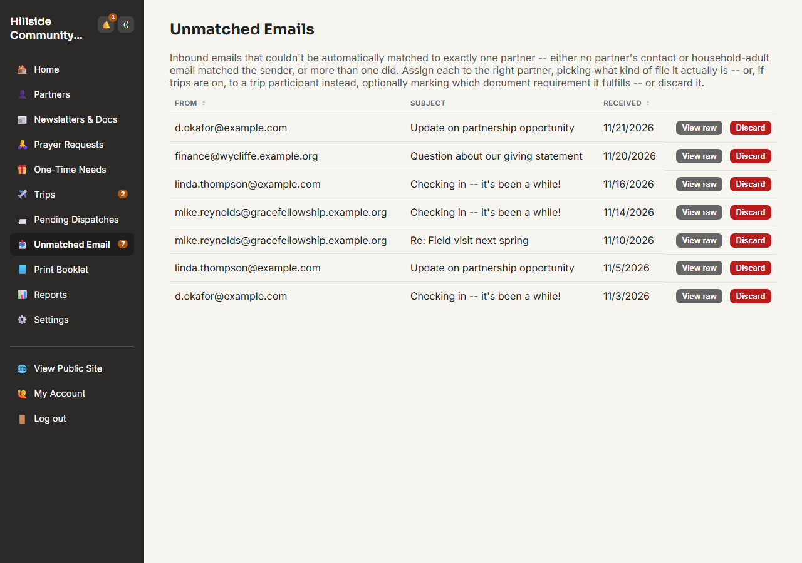

## Integrations

### Joshua Project (Admin only)

Shows country-level unreached-people-group statistics — population,
primary religion, percent evangelical, how reached the country is — on a
partner's page, pulled live from the [Joshua
Project](https://joshuaproject.net/). Off by default.

Setup, on the **Joshua Project** page under Settings, is one
step: paste an API key from
[joshuaproject.net/api/request](https://joshuaproject.net/api/request)
(free) and **Save API Key** — write-only once saved, same as a password
field; leave it blank on a later save to keep the existing one.

A key alone doesn't show anything — turn on **Joshua Project stats** in
[Enabled Features](ADMIN_GUIDE.md#feature-toggles). Once both are done,
it shows up everywhere it always has: a partner's admin page and public
page, wherever a Country Code is on file.

### AI Features (Admin only)

Adds a **Scan for requests** button on each newsletter/document that's
PDF, JPEG, PNG, or `.eml` (Word/Excel aren't supported). Sends that one
file to Claude (Anthropic's API) to look for prayer requests and
one-time financial needs, then shows them for review — nothing is added
until you explicitly accept a suggestion. Off by default, even once
configured, since it's the one feature here that sends data to a third
party.

Each suggestion's text box starts with a short background sentence
(resolving things like "the teenager we mentioned" to who that actually
is) ahead of the request itself, so you're editing one readable block
rather than a bare, context-free sentence — edit it freely before
accepting. Once accepted, the request or need shows a "From: ..." link
back to the newsletter or document it came from, visible only here in
the admin view.

That source link is set automatically here — accepting a suggestion sets
it for you. The same link can also be set by hand, whether or not this
feature is turned on, via the **Source** dropdown on each request/need's
Add or Edit form — see [Prayer Requests](#prayer-requests) and
[Financial support & one-time needs](#financial-support--one-time-needs).

Setup, on the **AI Features** page under Settings, is
one step: paste an API key from
[console.anthropic.com](https://console.anthropic.com/settings/keys) and
**Save API Key** — write-only once saved, same as a password field;
leave it blank on a later save to keep the existing one. Usage is
pay-per-scan on the key owner's Anthropic account — a few cents/month at
typical volume, not a flat fee.

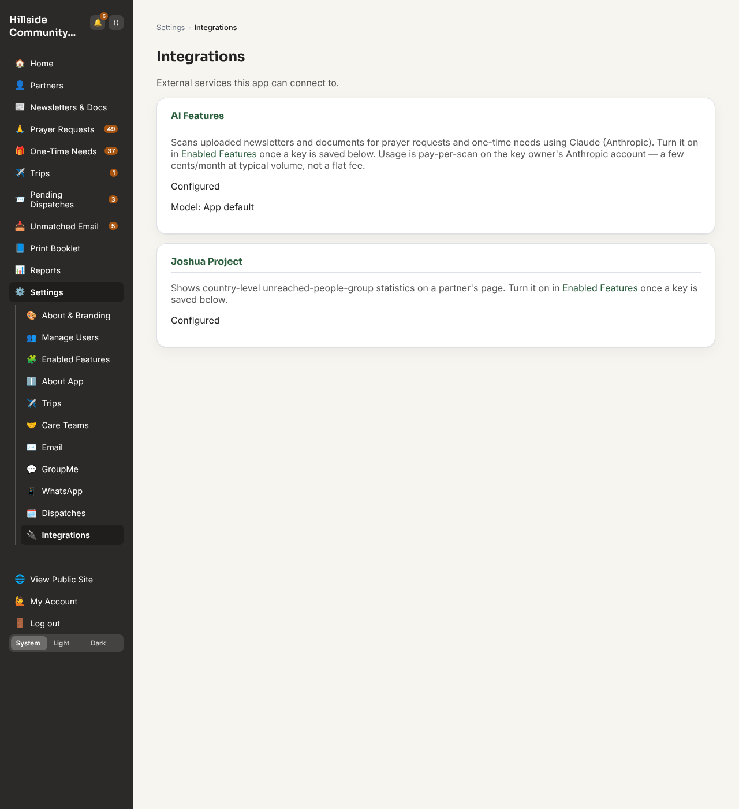

A key alone doesn't turn anything on — turn on **AI Features**
in [Enabled Features](ADMIN_GUIDE.md#feature-toggles) to actually show
the Scan for requests button.

## Your account & the public site

### Your account settings

**My Account** is where you manage your own login, regardless of role.
You can change your password (current password required) and
enable/disable two-factor authentication — enabling walks you through
scanning a QR code and confirming a code; disabling requires your current
password.

If [Email (Sending)](#email-admin-only) is turned on for the church,
there's also an **Email Dispatch** section here: a cadence (no
automatic digest by default, or one of whichever of biweekly, monthly,
and quarterly the admin has chosen to offer — see [Dispatch
Settings](#dispatch-settings-admin-only)) and, once a cadence is
picked, a choice between every partner or just the ones you check from
a list. If you'd already picked a cadence before the admin turned it
off, it stays selectable for you specifically — you're never silently
switched to something else. The digest itself
still includes prayer requests, one-time needs, and newsletters, same
as before — picking a cadence and scope here doesn't narrow what you
get, just when and for whom. It sends on whatever [Email
Schedule](#dispatch-settings-admin-only) the admin set up at Site
Administration → Dispatch Settings. You can also turn it off directly from
the unsubscribe link in any digest email, without logging in. Besides
your chosen cadence, you may occasionally get an item right away
outside that schedule — see [Marking something
urgent](#marking-something-urgent).

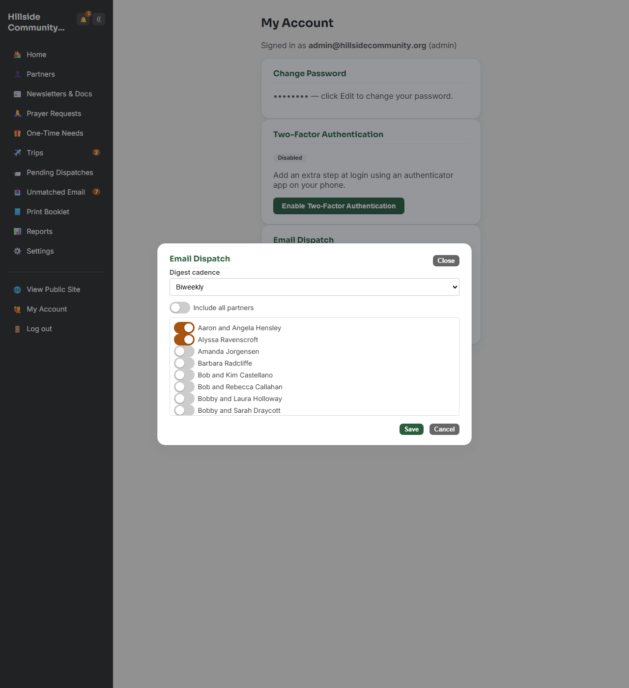

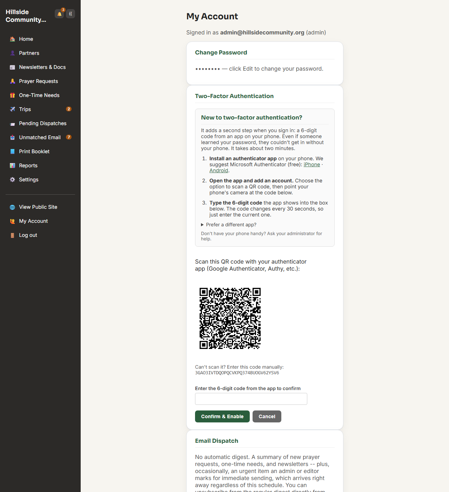

### The public site

Worth understanding what visitors actually see, since it's driven
entirely by what you check in the admin dashboard:
- **Partner Directory** (`/`) — a searchable, filterable grid (same
  continent/country/type filters as the admin Partners list) of everyone
  with `isPublic` checked. Search also matches the same way (diacritic-
  insensitive, multi-word) across name, field/region, focus area, short
  overview, country, and — unlike the admin Partners list — sending
  church/org name.

  
- **Map** (`/map`) — the same partners plotted on an interactive Leaflet
  map. Restricted partners show at country-level precision only, if they
  show at all — see
  [Understanding restricted-access partners](#understanding-restricted-access-partners).
  Organizations aren't part of the auto-tour cycle described below, but
  their pins are still clickable any time.

  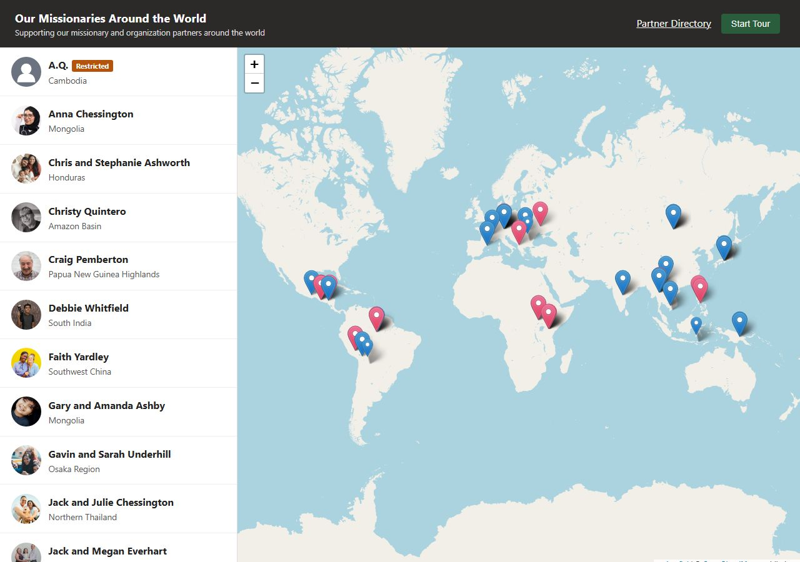
- **Partner detail page** — the fuller write-up linked from both the
  directory and the map, masked the same way for restricted partners. If
  the Joshua Project stats feature is turned on (see
  [ADMIN_GUIDE.md § Feature toggles](ADMIN_GUIDE.md#feature-toggles)), a
  **Show Country Statistics** button (visible whenever the partner has a
  Country Code set) fetches live population, primary religion, percent
  evangelical, and how reached that country is, straight from the
  [Joshua Project](https://joshuaproject.net/) — the same lookup the
  [Serving Location](#editing-a-partner) field offers on the
  admin side, here for visitors.

  
- **Subscribe** (`/subscribe`) — only shown once an admin turns on
  [Public prayer digest](ADMIN_GUIDE.md#feature-toggles). A dedicated page
  for getting prayer-request updates by email: no login, just an email
  address, a cadence choice (whichever of biweekly, monthly, and
  quarterly an admin has chosen to offer, pre-selected to monthly when
  it's available), and either every partner or several specific ones
  picked from a checklist. A visitor clicks a
  link in a confirmation email before anything actually sends (double
  opt-in — nothing goes out to an address nobody confirmed), and every
  digest they get after that carries its own one-click unsubscribe
  link. This public digest is **prayer requests only** — never a
  one-time need, never a newsletter or a link back to one — unlike the
  digest an admin can opt into from their own [Account
  Settings](#your-account-settings), which still includes both. A
  matching, smaller "Follow this partner's prayer requests" form sits on
  each partner's own detail page, for subscribing to just that one
  partner instead of everyone — it also points back to this page, and,
  when that partner has their own newsletter signup link, makes clear
  this is separate from (not a replacement for) subscribing to the
  partner's own newsletter directly. Either form's email only ever goes
  toward sending these updates — see the form's own privacy line for
  the exact wording, including the same occasional-urgent-item
  disclosure [Marking something urgent](#marking-something-urgent)
  describes.

  

#### The public map's auto-tour

The map can automatically cycle through missionary pins, flying to each
one and opening its popup — useful for an unattended display (e.g. a
lobby kiosk) as well as regular visitors:
- **Manual**: the "Start Tour" / "Stop Tour" button in the header toggles
  it. Clicking any pin or list card stops the tour and holds on that pin.
- **Auto-start via URL**: append `?tour=1` to the map's URL to start the
  tour immediately on load — a kiosk display just needs to open that URL
  once.
- **Speed**: `?tourSeconds=N` sets how long each pin stays in view before
  advancing (this alone also implies `?tour=1`). Defaults to 30 seconds.
- The tour always jumps to the first pin immediately when it (re)starts —
  it doesn't wait a full `tourSeconds` before the map first moves, even if
  a different pin was already active from earlier browsing.
- Only missionaries with a resolvable pin are included in the cycle — see
  [ADMIN_GUIDE.md § Troubleshooting](ADMIN_GUIDE.md#troubleshooting) if a
  restricted partner isn't showing up.

Nothing on the public site is editable — it's a read-only mirror of
whatever's marked public in the admin dashboard.
